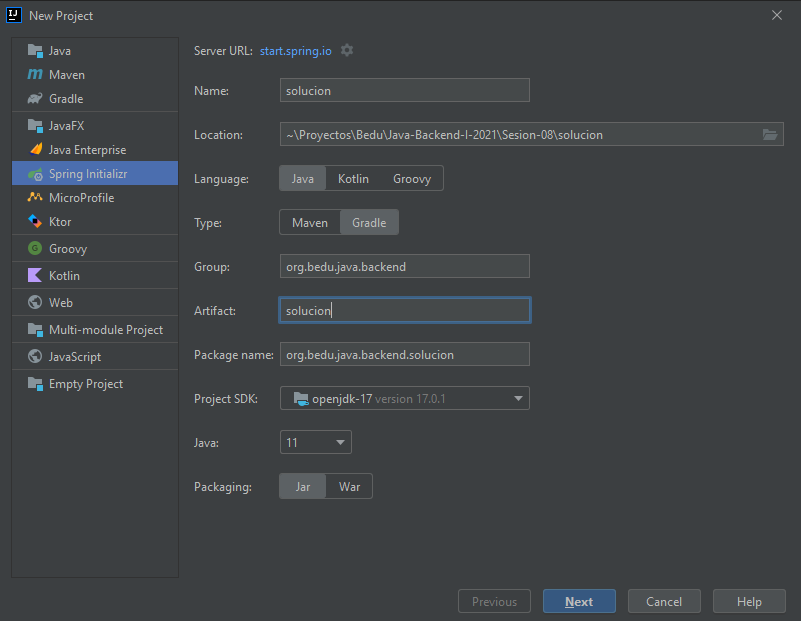
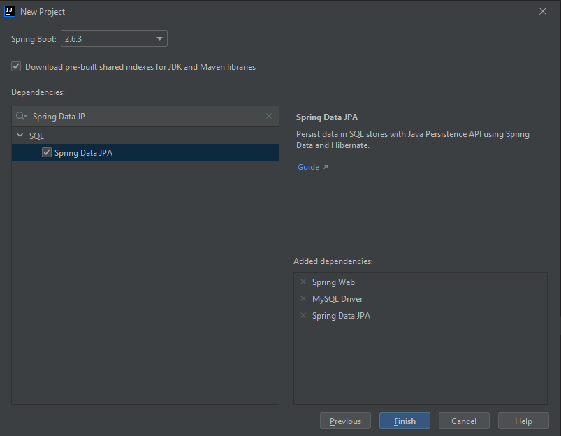
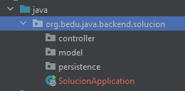
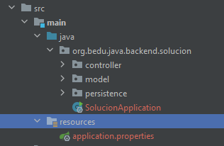
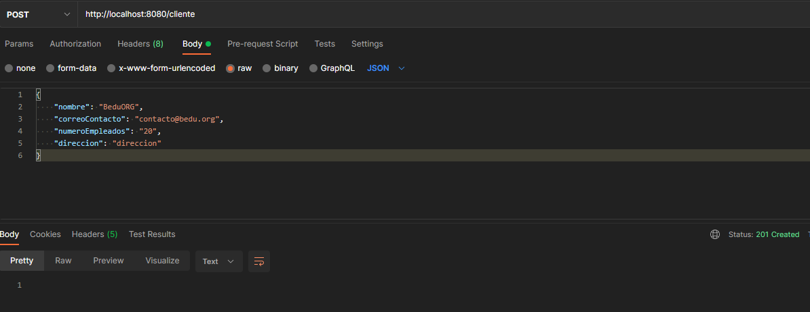
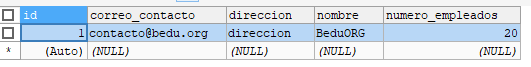

## Ejemplo 01: Persistencia de datos con Spring Data JPA

### OBJETIVO

- Hacer uso de las anotaciones básicas de JPA para indicar qué objeto debe ser tratado como una entidad de base de datos.
- Aprender qué es un repositorio y los métodos por default que ofrece.


### DESARROLLO

Antes de comenzar asegúrate de tener instado [MySQL Community Edition](https://www.mysql.com/products/community/) y de crear una base de datos llamada `bedu`.

Crea un proyecto usando Spring Initializr desde el IDE IntelliJ con las siguientes opciones:

  - Gradle Proyect (no te preocupes, no es necesario que tengas Gradle instalado).
  - Lenguaje: **Java**.
  - Versión de Spring Boot, la versión estable más reciente
  - Grupo, artefacto y nombre del proyecto.
  - Forma de empaquetar la aplicación: **jar**.
  - Versión de Java: **11** o superior.



En la siguiente ventana elige `Spring Web`, `MySQL Driver` y `Spring Data JPA` como dependencias del proyecto:



Presiona el botón "Finish".

Dentro del nuevo proyecto crea los siguientes subpaquetes: `controller`, `model` y `persistence`.



Dentro del paquete `model` crea una clase llamada `Cliente` con los siguientes atributos, y agrega sus correspondientes métodos **getter** y **setter**:

```java
public class Cliente {
    private Long id;
    private String nombre;
    private String correoContacto;
    private int numeroEmpleados;
    private String direccion;
}
```

Decora la clase con las anotaciones `@Entity` y `@Table` del paquete `javax.persistence`:

```java
@Entity
@Table(name = "CLIENTE")
public class Cliente {

}
```

Decora los atributos `id`, `correoContacto` y `numeroEmpleados` con las siguientes anotaciones (`nombre` y `direccion` permanecen igual)

```java
    @Id
    @GeneratedValue(strategy = GenerationType.IDENTITY)
    private Long id;
    private String nombre;

    @Column(name = "correo_contacto", length = 30)
    private String correoContacto;

    @Column(name = "numero_empleados")
    private int numeroEmpleados;

    private String direccion;
```

En el paquete persistence crea una interface llamada `ClienteRepository` que extienda de `JpaRepository`. Esta interface permanecerá sin métodos:

```java
public interface ClienteRepository  extends JpaRepository<Cliente, Long> {

}
```

En el paquete `controller` crea una nueva clase llamada `ClienteController` y decórala con las anotaciones de Spring MVC para indicar que esta clase es un controlador web.

```java
@RestController
@RequestMapping("/cliente")
public class ClienteController {

}
```

Agrega un atributo `final` de tipo `ClienteRepository`:

```java
  private final ClienteRepository clienteRepository;
```

Agrega un constructor a `ClienteController` e inyecta la la instancia de `ClienteRepository` usando la inyección de construcción:

```java
    @Autowired
    public ClienteController(ClienteRepository clienteRepository) {
        this.clienteRepository = clienteRepository;
    }
```

Crea un método **POST** que reciba un objeto `Cliente` como parámetro y regrese un código de respuesta `201`:

```java
    @PostMapping
    public ResponseEntity<Void> creaCliente(@RequestBody Cliente cliente){
        return ResponseEntity.created(URI.create("")).build();
    }
```

Dentro del método `creaCliente` usa el objeto `clienteRepository` para guardar el objeto `cliente` en base de datos. Usa el `id` del objeto almacenado para regresarlo en la respuesta del método.

```java
    @PostMapping
    public ResponseEntity<Void> creaCliente(@RequestBody Cliente cliente){

        Cliente clienteDB = clienteRepository.save(cliente);

        return ResponseEntity.created(URI.create(clienteDB.getId().toString())).build();
    }
```

En el directorio `resources` busca o crea el archivo `application.properties`.



Coloca el siguiente contenido en el archivo (personaliza el contenido en caso de ser necesario):

```groovy
spring.jpa.hibernate.ddl-auto=update
spring.jpa.hibernate.generate_statistics=true
spring.jpa.properties.hibernate.dialect=org.hibernate.dialect.MySQL5Dialect
spring.datasource.driver-class-name=com.mysql.cj.jdbc.Driver
spring.datasource.url=jdbc:mysql://localhost:3306/bedu?serverTimezone=UTC
spring.datasource.username=<usuario>
spring.datasource.password=<password>
```

Ejecuta la aplicación y envía la siguinte petición desde Postman:

```json
{
    "nombre": "BeduORG",
    "correoContacto": "contacto@bedu.org",
    "numeroEmpleados": "20",
    "direccion": "direccion"
}
```

debes tener la siguiente respuesta en la consola de Postman:




Revisa la base de datos, la tabla `CLIENTE` debe haberse creado de forma automática y debe tener almacenado el registro con los datos enviados desde Postman:

