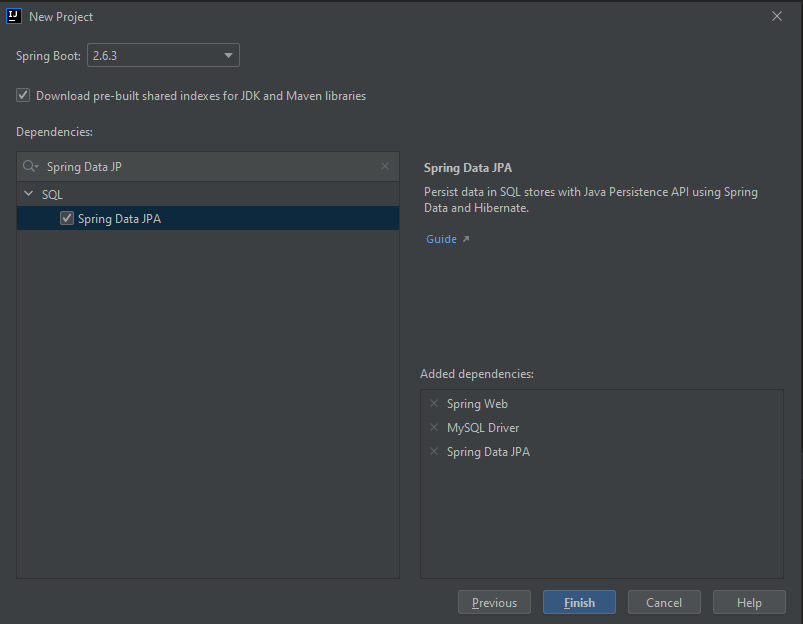
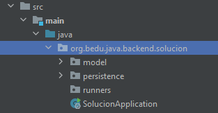
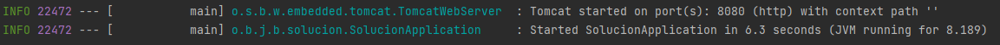
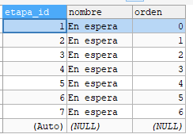

## Ejemplo 02: Inicialización de base de datos con CommandLineRunner 

### OBJETIVO

- Aprovechar la interface CommandLineRunner para ejecutar algunas tareas antes de que la aplicación comience a recibir peticiones.
- Inicializar valores de catálogos en base de datos.


### DESARROLLO

Antes de comenzar asegúrate de tener instado [MySQL Community Edition](https://www.mysql.com/products/community/) y de crear una base de datos llamada `bedu`.

Crea un proyecto usando Spring Initializr desde el IDE IntelliJ con las siguientes opciones:

  - Gradle Proyect (no te preocupes, no es necesario que tengas Gradle instalado).
  - Lenguaje: **Java**.
  - Versión de Spring Boot, la versión estable más reciente
  - Grupo, artefacto y nombre del proyecto.
  - Forma de empaquetar la aplicación: **jar**.
  - Versión de Java: **11** o superior.


En la siguiente ventana elige `Spring Web`, `MySQL Driver` y `Spring Data JPA` como dependencias del proyecto:



Presiona el botón "Finish".

Dentro del nuevo proyecto crea los siguientes subpaquetes: `runners`, `model` y `persistence`.



Dentro del paquete `model` crea una clase llamada `Etapa` con los siguientes atributos, junto con sus **getters** y **setters** :

```java
public class Etapa {
    private Long etapaId;
    private String nombre;
    private Integer orden;
}
```

Decora también la clase con las siguientes anotaciones de JPA del paquete `javax.persistence`:

```java
@Entity
@Table(name = "ETAPAS")
public class Etapa {

}
```

Decora los atributos con las siguientes anotaciones de JPA:

```java
    @Id
    @GeneratedValue(strategy = GenerationType.IDENTITY)
    private Long etapaId;

    @Column(nullable = false, length = 100)
    private String nombre;

    @Column(nullable = false, unique = true)
    private Integer orden;
```

En el paquete `persistence` crea una interface llamada `EtapaRepository` que extienda de `JpaRepository`. Esta interface permanecerá sin métodos:

```java
public interface EtapaRepository extends JpaRepository<Etapa, Long> {

}
```

En el paquete `runners` crea una nueva clase llamada `EtapasVentaRunner` que implemente la interface `CommandLineRunner`. Decora esta clase con la anotación `@Component` de Spring.

```java
@Component
public class EtapasVentaRunner implements CommandLineRunner {

    @Override
    public void run(String... args) throws Exception {
    
    }
}
```

Declara un atributo `final` de tipo `EtapaRepository` e inyecta esta dependencia usando inyección por constructor:

```java
@Component
public class EtapasVentaRunner implements CommandLineRunner {

    private final EtapaRepository etapaRepository;

    @Autowired
    public EtapasVentaRunner(EtapaRepository etapaRepository) {
        this.etapaRepository = etapaRepository;
    }

    @Override
    public void run(String... args) throws Exception {

    }
}
```

Dentro del método `run` crea un grupo de objetos de tipo `Etapa` y guárdalos en la base de datos usando la instancia de `etapaRepository`. Usaremos un método auxiliar para crear las instancias de `Etapa`.

```java
    @Override
    public void run(String... args) throws Exception {
        Etapa etapa1 = creaEtapa("En espera", 0);
        Etapa etapa2 = creaEtapa("Reunión de exploración", 1);
        Etapa etapa3 = creaEtapa("Metas establecidas", 2);
        Etapa etapa4 = creaEtapa("Plan de acción presentado.", 3);
        Etapa etapa5 = creaEtapa("Contrato firmado", 4);
        Etapa etapa6 = creaEtapa("Venta ganada", 5);
        Etapa etapa7 = creaEtapa("Venta perdida", 6);

        List<Etapa> etapas = Arrays.asList(etapa1, etapa2, etapa3, etapa4, etapa5, etapa6, etapa7);

        etapaRepository.saveAll(etapas);
    }

    private Etapa creaEtapa(String nombre, Integer orden) {
        Etapa etapa = new Etapa();
        etapa.setNombre("En espera");
        etapa.setOrden(orden);

        return etapa;
    }
```

Ejecuta la aplicación. No debería haber ningún error en la consola y la aplicación debe iniciar de forma correcta. 



La base de datos debe estar inicializada con las `Etapas`:


