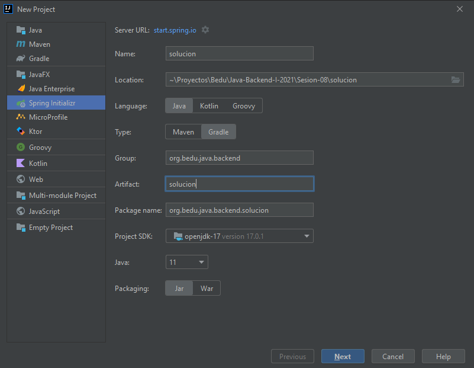
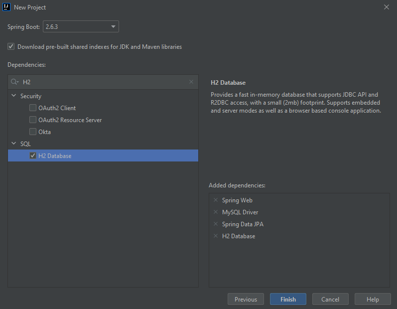
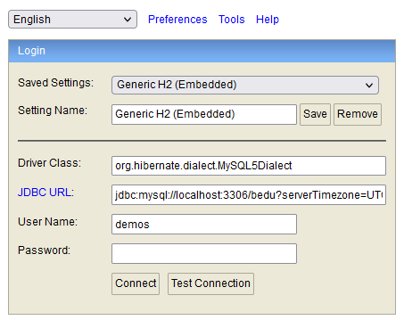
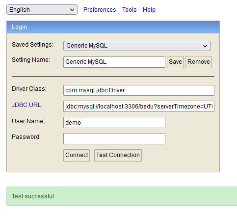
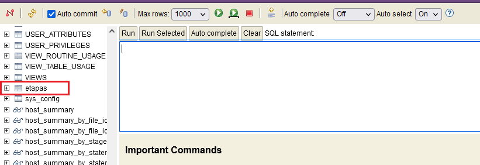
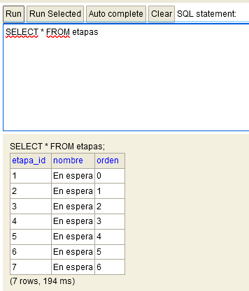

## Ejemplo 03: Consola de H2

### OBJETIVO

- Usar la consola integrada con la base de datos embebida H2 para conectarnos a la instancia de MySQL.
- Proporcionar un mecanismo sencillo para poder adminsitrar la información de la base de datos sin herramientas externas.


### DESARROLLO

Antes de comenzar asegúrate de tener instado [MySQL Community Edition](https://www.mysql.com/products/community/) y de crear una base de datos llamada `bedu`.

Crea un proyecto usando Spring Initializr desde el IDE IntelliJ con las siguientes opciones:

  - Gradle Proyect (no te preocupes, no es necesario que tengas Gradle instalado).
  - Lenguaje: **Java**.
  - Versión de Spring Boot, la versión estable más reciente
  - Grupo, artefacto y nombre del proyecto.
  - Forma de empaquetar la aplicación: **jar**.
  - Versión de Java: **11** o superior.



En la siguiente ventana elige `Spring Web`, `MySQL Driver`, `Spring Data JPA` y `H2 Database` como dependencias del proyecto:



Presiona el botón "Finish".

Dentro del nuevo proyecto crea los siguientes subpaquetes: `model` y `persistence`.

Dentro del paquete `model` crea una clase llamada `Etapa` con los siguientes atributos, junto con sus **getters** y **setters** :

```java
public class Etapa {
    private Long etapaId;
    private String nombre;
    private Integer orden;
}
```

Decora también la clase con las siguientes anotaciones de JPA del paquete `javax.persistence`:

```java
@Entity
@Table(name = "ETAPAS")
public class Etapa {

}
```

Decora los atributos con las siguientes anotaciones de JPA:

```java
    @Id
    @GeneratedValue(strategy = GenerationType.IDENTITY)
    private Long etapaId;

    @Column(nullable = false, length = 100)
    private String nombre;

    @Column(nullable = false, unique = true)
    private Integer orden;
```

En el paquete `persistence` crea una interface llamada `EtapaRepository` que extienda de `JpaRepository`. Esta interface permanecerá sin métodos:

```java
public interface EtapaRepository extends JpaRepository<Etapa, Long> {

}
```

Coloca el siguiente contenido en el archivo `application.properties` (los valores entre los signos < y > reemplazalos con tus propios valores):

```groovy
spring.h2.console.enabled=true
spring.jpa.hibernate.ddl-auto=none
spring.sql.init.mode=always
spring.jpa.open-in-view=false
spring.jpa.properties.hibernate.dialect=org.hibernate.dialect.MySQL5Dialect
spring.datasource.driver-class-name=com.mysql.cj.jdbc.Driver
spring.datasource.url=jdbc:mysql://localhost:3306/bedu?serverTimezone=UTC
spring.datasource.username=<usuario>
spring.datasource.password=<password>
```

Ejecuta la aplicación. No debería haber ningún error en la consola y la aplicación debe iniciar de forma correcta. 

Ingresa a la siguiente dirección en tu navegador [http://localhost:8080/h2-console/](http://localhost:8080/h2-console/). Debes ver una venta como la siguiente:



Cambia la información del `Driver Class`, `JDBC URL`, `User Name` y `Password` a los valores correspondientes a MySQL (los que tienes en el archivo `application.properties`).

- Driver Class: org.hibernate.dialect.MySQL5Dialect
- JDBC URL: jdbc:mysql://localhost:3306/bedu?serverTimezone=UTC

Presiona el botón `Test Connection`, debe aparecer un mensaje indicando que la prueba es exitosa (y el password debe haber desaparecido).



Vuelve a colocar el password y presiona el botón Connect debes entrar a la consola de H2. Esta consla muestra muchas tablas. Las de tu aplicación serán las últimas:



Escribe una consulta en la consola; la información aparcera en el panel de respuestas.

