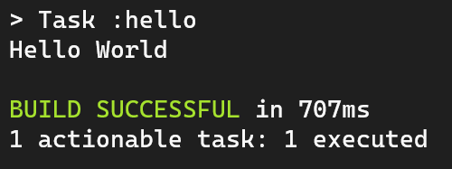

## Ejemplo 01: Tareas personalizadas

### OBJETIVO

- Crear un archivo `build.gradle`
- Crear una tarea personalizada en **Gradle**

### DESARROLLO

Comenzamos creando un archivo llamado `build.gradle`.

> 💡 *Nota: Es importante verificar que el archivo se llame exactamente `build.gradle` dado que Gradle busca un archivo con ese nombre para saber qué hacer.*

A continuación escribiremos las siguientes líneas que nos ayudarán a definir nuestra tarea personalizada:

```groovy
task hello {
}
```

¿No entiendes que acabamos de escribir? ¡Tranquilo! 😅

Lo que acabamos de escribir es la definición de una **tarea** en lenguaje **Groovy**, es decir, una **función** llamada *hello* (nombre al que haremos referencia a la tarea para poder ejecutarla).

Lo siguiente será escribir lo que queremos que haga la tarea, en este caso queremos que imprima en pantalla la palabra "Hello World":

```groovy
task hello {
  doLast {
    println 'Hello World'
  }
}
```

Nuevamente escribimos una función llamanda *doLast* que nos permite ejecutar líneas de código en lenguaje Groovy.

Por último `println 'Hello World'` puedes verlo como usar `System.out.println` de Java, es decir, imprimimos en pantalla la palabra "Hello World".

Guardamos el archivo, abrimos la terminal y ubicados en la carpeta que contenga el archivo `build.gradle` ejecutaremos el siguiente comando:

`gradle hello`

Teniendo como resultado:



¡Muy bien! Acabamos de ejecutar nuestra primer tarea personalizada de Gradle 🎉🥳🎊