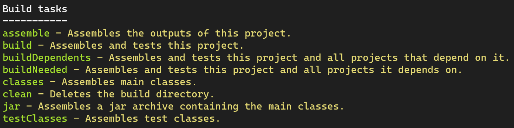
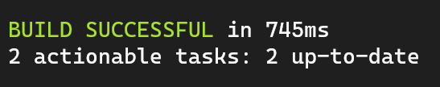

## Ejemplo 02: Compilar un programa en Java

### OBJETIVO

- Compilar un archivo con código en lenguaje Java a través de Gradle.

### DESARROLLO

En el ejercicio anterior vimos una de las características más importantes de Gradle que es la definición y ejecución de tareas, pero entonces... ¿si quiero ejecutar un código real entonces debo escribir mis propias tareas? 😯😓😔😕 

**¡AFORTUNADAMENTE NO!**

Como vimos en el Prework, en Gradle existen los llamados **plugins** que son complementos que nos ayudan a agilizar la construcción de nuestros proyectos (en este caso en particular, un programa en Java).

Comenzaremos creando nuestro archivo `build.gradle` el cual deberá contener las siguientes lineas:

```groovy
plugins {
  id 'java'
}
```

Con estas simples líneas Gradle entenderá que hay que usar el **plugin de Java**. Por lo tanto al momento de ejecutar el comando `gradle tasks` veremos las siguientes tareas:



Todas las tareas están disponibles gracias al plugin de Java.

Entre todas las tareas la que nos interesa es la llamada **build** el cual compilará nuestro programa y creará un archivo JAR.

A continuación escribiremos nuestro programa en Java, para eso crearemos la siguiente estructura de carpetas:

`src` > `main` > `java`

Después, en la carpeta `java` crearemos un archivo llamado `HelloWorldExample.java` con el siguiente código:

```java
public class HelloWorldExample {
  public static void main(String [] args) {
    System.out.println("Hello from Java");
  }
}
```

Como puedes ver, es un código bastante básico que imprime en pantalla "Hello from Java".

Ahora ha llegado el momento de la verdad, ejecutaremos el comando `gradle build` para compilar nuestro código obteniendo el siguiente resultado:



Esto quiere decir que el código fue compilado con éxito 😎.