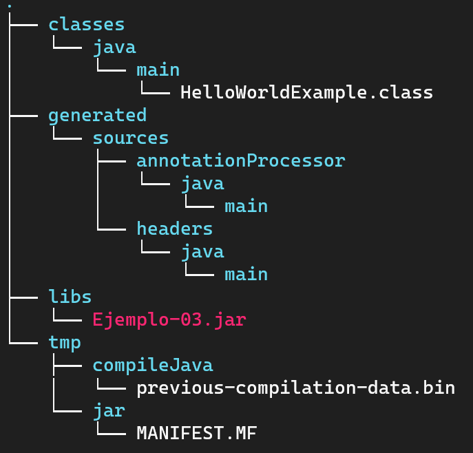
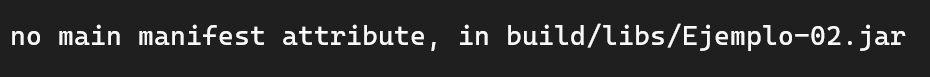
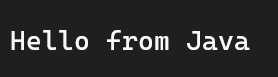

## Ejemplo 03: Ejecutar el JAR generado por Gradle

### OBJETIVO

- Ejecutar de manera satisfactoria el JAR generado por Gradle

### DESARROLLO

En el ejercicio anterior pudimos compilar un archivo Java usando el plugin de Java pero... ¿notaste algo más al ejecutar el comando `gradle build`? 🤔

Además de compilar nuestro código, Gradle genera una carpeta llamada **build** que entre muchas cosas contiene el archivo JAR resultado de compilar nuestro código Java:



> 💡 *Nota: El JAR resultante tendrá el nombre de la carpeta que contenga el archivo build.gradle.*

Por lo tanto, si queremos ejecutar cualquier archivo JAR basta con ejecutar el comando `java -jar archivo.jar`.

Pero lamentablemente si ejecutamos el JAR generado por Gradle obtendremos el siguiente resultado:



¿Qué salió mal? 😫😭

Básicamente el JAR generado no contiene la referencia de la clase principal, por lo tanto modificaremos el archivo `build.gradle` para incluir las siguientes líneas:

```groovy
//...

jar {
  manifest {
    attributes 'Main-Class': 'HelloWorldExample'
  }
}
```

Con esto especificamos que el JAR generado al momento de ejecutar el comando `gradle build` utilice la clase `HelloWorldExample` como clase principal en su ejecución.

Por último ejecutaremos nuevamente el comando `gradle build` para generar nuevamente el archivo JAR y al ejecutar el JAR obtendremos el siguiente resultado:

