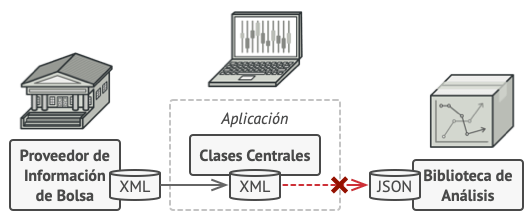

## Ejemplo 02: Patrones Estructurales

### OBJETIVO

- Aprender los casos de uso de los Patrones Estructurales

### DESARROLLO

Los patrones estructurales se enfocan en como las clases y objetos se componen para formar estructuras mayores, los patrones estructurales describen como las estructuras compuestas por clases crecen para crear nuevas funcionalidades de manera de agregar a la estructura flexibilidad y que la misma pueda cambiar en tiempo de ejecución lo cual es imposible con una composición de clases estáticas.

Los patrones estructurales son:

- **Adapter:** Permite a dos clases con diferentes interfaces trabajar entre ellas, a través de un objeto intermedio con el que se comunican e interactúan.

- **Bridge:** Desacopla una abstracción de su implementación, para que las dos puedan evolucionar de forma independiente.

- **Composite:** Facilita la creación de estructuras de objetos en árbol, donde todos los elementos emplean una misma interfaz. Cada uno de ellos puede a su vez contener un listado de esos objetos, o ser el último de esa rama.

- **Decorator:** Permite añadir funcionalidad extra a un objeto (de forma dinámica o estática) sin modificar el comportamiento del resto de objetos del mismo tipo.

- **Facade:** Una facade (o fachada) es un objeto que crea una interfaz simplificada para tratar con otra parte del código más compleja, de tal forma que simplifica y aísla su uso. Un ejemplo podría ser crear una fachada para tratar con una clase de una librería externa.

- **Flyweight:** Una gran cantidad de objetos comparte un mismo objeto con propiedades comunes con el fin de ahorrar memoria.

- **Proxy:** Es una clase que funciona como interfaz hacia cualquier otra cosa: una conexión a Internet, un archivo en disco o cualquier otro recurso que sea costoso o imposible de duplicar.

Para este ejemplo analizaremos el patrón **Adapter**.

#### Definición

**Adapter** es un patrón de diseño estructural que permite la colaboración entre objetos con interfaces incompatibles.

#### Problema

Imagina que estás creando una aplicación de monitoreo del mercado de valores. La aplicación descarga la información de bolsa desde varias fuentes en formato XML para presentarla al usuario con bonitos gráficos y diagramas.

En cierto momento, decides mejorar la aplicación integrando una inteligente biblioteca de análisis de una tercera persona. Pero hay una trampa: la biblioteca de análisis solo funciona con datos en formato JSON.

Podrías cambiar la biblioteca para que funcione con XML. Sin embargo, esto podría descomponer parte del código existente que depende de la biblioteca. Y, lo que es peor, podrías no tener siquiera acceso al código fuente de la biblioteca, lo que hace imposible esta solución.




#### Solución

Puedes crear un **adaptador**. Se trata de un objeto especial que convierte la interfaz de un objeto, de forma que otro objeto pueda comprenderla.

Un adaptador envuelve uno de los objetos para esconder la complejidad de la conversión que tiene lugar tras bambalinas. El objeto envuelto ni siquiera es consciente de la existencia del adaptador. Por ejemplo, puedes envolver un objeto que opera con metros y kilómetros con un adaptador que convierte todos los datos al sistema anglosajón, es decir, pies y millas.

Los adaptadores no solo convierten datos a varios formatos, sino que también ayudan a objetos con distintas interfaces a colaborar. Funciona así:

El adaptador obtiene una interfaz compatible con uno de los objetos existentes.
Utilizando esta interfaz, el objeto existente puede invocar con seguridad los métodos del adaptador.
Al recibir una llamada, el adaptador pasa la solicitud al segundo objeto, pero en un formato y orden que ese segundo objeto espera.

En ocasiones se puede incluso crear un adaptador de dos direcciones que pueda convertir las llamadas en ambos sentidos.


#### Implementación

Comenzamos con nuestras clases iniciales, la primera obtiene la información de la bolsa de valores en formato XML y la segunda procesa la información en formato JSON:

```java
public interface StockMarketReport {
  public String download();
}
```

```java
public class StockMarket implements StockMarketReport {

  @Override
  public String download() {
    String xml = "";

    // Proceso para convertir la información a XML...
    System.out.println("Descargando información en formato XML...");

    return xml;
  }
}
```

```java
public class AnalysisLibrary {

  public void analyzeInformation(String json) throws Exception {
    if (!validateJSON(json)) {
      throw new Exception("La información no tiene formato JSON");
    }

    // Procesa la información obtenida en JSON
    System.out.println("Procesando la información...");
  }

  public boolean validateJSON(String data) {
    // Valida si la información llega en formato JSON

    return true;
  }
}
```

Como podemos ver ambas clases son totalmente incompatibles, por lo tanto creamos nuestra clase `StockMarketAdapter`:

```java
public class StockMarketAdapter implements StockMarketReport {

  private StockMarket stockMarket;

  public StockMarketAdapter() {
    stockMarket = new StockMarket();
  }

  @Override
  public String download() {
    String xml = stockMarket.download();
    return convertToJson(xml);
  }

  public String convertToJson(String xml) {
    String json = "";

    // Proceso para convertir de XML a JSON
    System.out.println("Convirtiendo la información de XML a JSON...");

    return json;
  }
}
```

Por último creamos una clase que nos permita probar nuestro código:

```java
public class Application {

  public static void main(String [] args) throws Exception {
    StockMarketReport report = new StockMarketAdapter();
    String json = report.download();

    AnalysisLibrary library = new AnalysisLibrary();
    library.analyzeInformation(json);
  }
}
```

> 💡 *Nota: Recuerda que todos los ejemplos y retos de esta sesión utilizarán la misma configuración de Gradle, cambiando únicamente la clase principal del proyecto*

```groovy
plugins {
  id 'application'
}

application {
  mainClass = "Application"
}
```