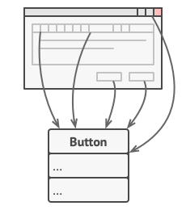
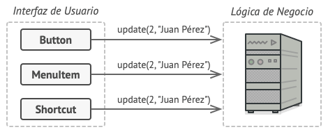
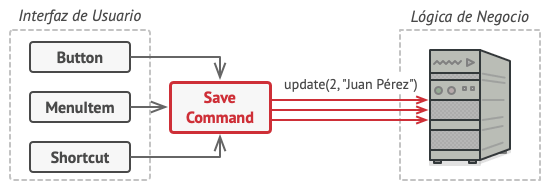

## Ejemplo 03: Patrones de Comportamiento

### OBJETIVO

- Aprender los casos de uso de los Patrones de Comportamiento

### DESARROLLO

Los patrones de comportamiento tratan con algoritmos y la asignación de responsabilidades entre objetos.

Los patrones de comportamiento son:

- **Command:** Son objetos que encapsulan una acción y los parámetros que necesitan para ejecutarse.

- **Chain of responsibility:** se evita acoplar al emisor y receptor de una petición dando la posibilidad a varios receptores de consumirlo. Cada receptor tiene la opción de consumir esa petición o pasárselo al siguiente dentro de la cadena.

- **Interpreter:** Define una representación para una gramática así como el mecanismo para evaluarla. El árbol de sintaxis del lenguaje se suele modelar mediante el patrón Composite.

- **Iterator:** Se utiliza para poder movernos por los elementos de un conjunto de forma secuencial sin necesidad de exponer su implementación específica.

- **Mediator:** Objeto que encapsula cómo otro conjunto de objetos interactúan y se comunican entre sí.

- **Memento:** Este patrón otorga la capacidad de restaurar un objeto a un estado anterior.

- **Observer:** Los objetos son capaces de suscribirse a una serie de eventos que otro objetivo va a emitir, y serán avisados cuando esto ocurra.

- **State:** Permite modificar la forma en que un objeto se comporta en tiempo de ejecución, basándose en su estado interno.

- **Strategy:** Permite la selección del algoritmo que ejecuta cierta acción en tiempo de ejecución.
Template Method: Especifica el esqueleto de un algoritmo, permitiendo a las subclases definir cómo implementan el comportamiento real.

- **Visitor:** Permite separar el algoritmo de la estructura de datos que se utilizará para ejecutarlo. De esta forma se pueden añadir nuevas operaciones a estas estructuras sin necesidad de modificarlas.

Para este ejemplo analizaremos el patrón **Command**.

#### Definición

El patrón **Command** es un patrón de diseño de comportamiento que convierte una solicitud en un objeto independiente que contiene toda la información sobre la solicitud. Esta transformación te permite parametrizar los métodos con diferentes solicitudes, retrasar o poner en cola la ejecución de una solicitud y soportar operaciones que no se pueden realizar.


#### Problema

Imagina que estás trabajando en una nueva aplicación de edición de texto. Tu tarea actual consiste en crear una barra de herramientas con unos cuantos botones para varias operaciones del editor. Creaste una clase Botón muy limpia que puede utilizarse para los botones de la barra de herramientas y también para botones genéricos en diversos diálogos.



Aunque todos estos botones se parecen, se supone que hacen cosas diferentes. ¿Dónde pondrías el código para los varios gestores de clics de estos botones? La solución más simple consiste en crear cientos de subclases para cada lugar donde se utilice el botón. Estas subclases contendrán el código que deberá ejecutarse con el clic en un botón.


Pronto te das cuenta de que esta solución es muy deficiente. En primer lugar, tienes una enorme cantidad de subclases, lo cual no supondría un problema si no corrieras el riesgo de descomponer el código de esas subclases cada vez que modifiques la clase base Botón. Dicho de forma sencilla, tu código GUI depende torpemente del volátil código de la lógica de negocio.


Y aquí está la parte más desagradable. Algunas operaciones, como copiar/pegar texto, deben ser invocadas desde varios lugares. Por ejemplo, un usuario podría hacer clic en un pequeño botón “Copiar” de la barra de herramientas, o copiar algo a través del menú contextual, o pulsar Ctrl+C en el teclado.

Inicialmente, cuando tu aplicación solo tenía la barra de herramientas, no había problema en colocar la implementación de varias operaciones dentro de las subclases de botón. En otras palabras, tener el código para copiar texto dentro de la subclase BotónCopiar estaba bien. Sin embargo, cuando implementas menús contextuales, atajos y otros elementos, debes duplicar el código de la operación en muchas clases, o bien hacer menús dependientes de los botones, lo cual es una opción aún peor.

#### Solución

El buen diseño de software a menudo se basa en el principio de separación de responsabilidades, lo que suele tener como resultado la división de la aplicación en capas. El ejemplo más habitual es tener una capa para la interfaz gráfica de usuario (GUI) y otra capa para la lógica de negocio. La capa GUI es responsable de representar una bonita imagen en pantalla, capturar entradas y mostrar resultados de lo que el usuario y la aplicación están haciendo. Sin embargo, cuando se trata de hacer algo importante, como calcular la trayectoria de la luna o componer un informe anual, la capa GUI delega el trabajo a la capa subyacente de la lógica de negocio.

El código puede tener este aspecto: un objeto GUI invoca a un método de un objeto de la lógica de negocio, pasándole algunos argumentos. Este proceso se describe habitualmente como un objeto que envía a otro una solicitud.



El patrón Command sugiere que los objetos GUI no envíen estas solicitudes directamente. En lugar de ello, debes extraer todos los detalles de la solicitud, como el objeto que está siendo invocado, el nombre del método y la lista de argumentos, y ponerlos dentro de una clase comando separada con un único método que activa esta solicitud.

Los objetos de comando sirven como vínculo entre varios objetos GUI y de lógica de negocio. De ahora en adelante, el objeto GUI no tiene que conocer qué objeto de la lógica de negocio recibirá la solicitud y cómo la procesará. El objeto GUI activa el comando, que gestiona todos los detalles.



El siguiente paso es hacer que tus comandos implementen la misma interfaz. Normalmente tiene un único método de ejecución que no acepta parámetros. Esta interfaz te permite utilizar varios comandos con el mismo emisor de la solicitud, sin acoplarla a clases concretas de comandos. 

#### Implementación

Comenzaremos implementando la interfaz que servirá para definir nuestros comandos:

```java
public interface Command {
  public void execute();
}
```

Todos los comandos debes implementar esta interfaz. Ahora implementaremos nuestro comando para guardar el archivo:

```java
public class SaveCommand implements Command {

  @Override
  public void execute() {
    System.out.println("Guardando archivo...");
  }
}
```

Ahora implementaremos nuestro editor de texto que ejecutará el comando en 3 momentos diferentes:

- Cuando el usuario presiona el botón para guardar
- Cuando el usuario presiona la opción de guardar en el menú
- Cuando el usuario presiona una combinación en el teclado

```java
public class TextEditor {

  private Command saveCommand;

  public TextEditor() {
    saveCommand = new SaveCommand();
  }

  /*
    Guarda el archivo cuando el usuario
    presiona el botón de GUARDAR
  */
  public void onPressSaveButton() {
    System.out.println("[Save Button]");
    saveCommand.execute();
  }

  /*
    Guarda el archivo cuando el usuario
    presiona en el menú "GUARDAR ARCHIVO".
  */
  public void onMenuSaveOption() {
    System.out.println("[Menu]");
    saveCommand.execute();
  }

  /*
    Guardar el archivo cuando el usuario
    presiona la combinación en el teclado.
  */
  public void onShortcut() {
    System.out.println("[Shortcut]");
    saveCommand.execute();
  }
}
```

Por último implementaremos una clase que nos ayudará a probar nuestro editor:

```java
public class Application {

  public static void main(String[] args) {
    TextEditor editor = new TextEditor();

    // El usuario presiona el botón de guardar
    editor.onPressSaveButton();

    // El usuario presiona la opción de guardar en el menú
    editor.onMenuSaveOption();

    // El usuario presiona la combinación en el teclado
    editor.onShortcut();
  }
}
```

> 💡 *Nota: Recuerda que todos los ejemplos y retos de esta sesión utilizarán la misma configuración de Gradle, cambiando únicamente la clase principal del proyecto*

```groovy
plugins {
  id 'application'
}

application {
  mainClass = "Application"
}
```