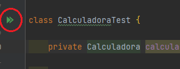

## Ejemplo 01: Pruebas unitarias con JUnit 

### OBJETIVO

- Aprender a crear y ejecutar una prueba usando JUnit 

### DESARROLLO

JUnit es uno de los frameworks de pruebas más populares en el ecosistema de la tecnología Java. La versión 5 de JUnit contiene muchas características útiles que nos ayudan a cumplir con el objetivo de desarrollar muchos tipos distintos de pruebas unitarias y de integración. 

#### Arquitectura

JUnit 5 está compuesto por una variedad de módulos diferentes divididos en tres módulos:

- **JUnit Platform**: La plataforma es el módulo responsable de ejecutar las pruebas en la JVM. Define una serie de interfaces poderosas entre JUnit y sus clientes, como las herramientas de compilación (Gradle, Maven) o los IDEs.
- **JUnit Jupiter**: Es el módulo que contiene los modelos y extensiones de JUnit. Este será el módulo que usaremos para escribir nuestras pruebas.
- **JUnit Vintage**: Soporta la ejecución de pruebas basadas en JUnit 3 y 4 dentro de un entorno JUnit 5. Sirve mucho para cuando tenemos aplicaciones o código legado.

#### Anotaciones básicas

- `@Test`: Esta es la anotación que más usarás de JUnit. Indica que un método debe tratarse como un caso de una prueba unitaria. JUnit ejecuta todos los métodos habilitados que contengan esta anotación.
- `@Disabled`: Indica que un caso de prueba particular debe ignorarse, y por lo tanto no se ejecutará.
- `@BeforeEach`: Indica que el método anotado será ejecutado antes de cada uno de los métodos de prueba. Se usa cuando queremos inicializar y reinicializar información o configuración antes de cada prueba.
- `@AfterEach`: Indica que el método anotado se ejecutará después de cada uno de los métodos de prueba. Se usa cuando queremos limpiar o liberar algún recurso después de cada prueba.
- `@BeforeAll`: Indica que el método anotado se ejecutará antes de ejecutar los métodos de prueba. Se ejecuta una sola vez durante toda la prueba.
- `@AfterAll`: Indica que el método anotado se ejecutará después de que se haya terminado la ejecución de todos los métodos de prueba. Se ejecuta una solo vez durante toda la prueba.


#### Implementación

Lo primero que debemos hacer es incluir la dependencia de JUnit en nuestro proyecto. Esto lo hacemos colocando la siguiente línea en el archivo `build.gradle`, las cuales indican que debemos usar la dependencia de Junit Jupiter solo en la etapa de pruebas:

```groovy
dependencies {
    testImplementation 'org.junit.jupiter:junit-jupiter-api:5.8.1'
    testRuntimeOnly 'org.junit.jupiter:junit-jupiter-engine:5.8.1'
}

test {
    useJUnitPlatform()
}

```

Ahora creamos una clase que contenga la siguiente lógica de sumas y restas.

```java
public class Calculadora{

    public int suma(int a, int b) {
        return a + b;
    }

    public int resta(int a, int b) {
        return a - b;
    }

    public int multiplica(int a, int b) {
        return a * b;
    }
}

```

Ahora implementamos la clase de prueba que nos permitirá verificar su funcionamiento:

```java
class CalculadoraTest {

    private Calculadora calculadora = new Calculadora();

    @Test
    @DisplayName("Prueba suma")
    void sumaTest() {
        int esperado = 5;

        assertEquals(esperado, calculadora.suma(3, 2));
    }

    @Test
    @DisplayName("Prueba resta")
    void restaTest() {
        int esperado = 1;

        assertEquals(esperado, calculadora.resta(3, 2));
    }

    @Test
    @DisplayName("Prueba multiplicación")
    void multiplicaTest() {
        int esperado = 6;

        assertEquals(esperado, calculadora.multiplica(3, 2));
    }
}
```


Ejecuta la prueba haciendo clic derecho sobre el editor de código y seleccionando la opción `Run CalculadoraTest` o haciendo clic sobre las dos flechas verdes que aparecen junto al nombre de la clase:



Debes ver el siguiente resultado en la consola del IDE:


