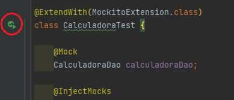

## Ejemplo 02: Pruebas unitarias con JUnit y Mockito

### OBJETIVO

- Crear una prueba que valide el correcto funcionamiento de una clase o componente.
- Simular el funcionamiento de una clase que aún no existe, usando un mock creado con Mockito.

### DESARROLLO

Uno de los puntos más importantes al desarrollar una prueba unitaria es que esta debe validar un funcionamiento particular de una método o clase de forma aislada de otras funcionalidades; sin embargo, en una aplicación esto no siempre es fácil de lograr, ya que nuestras clases tienen relación y dependen a su vez de otras clases. Para poder aislar completamente los componentes y funcionalidades requeridos por una prueba unitaria existen varias técnicas, una de las más populares es el uso de **dobles de prueba** u objetos *mock*, lo cuales son objetos que sustituyen a las clases reales y a las cuales podemos definirles el comportamiento esperado.

Es posible crear mocks manualmente, pero ya existen frameworks que pueden hacerlo por nosotros, estos permiten crear objetos mock en tiempo de ejecución y definir su comportamiento. *Mockito* es uno de los frameworks más ampliamente utilizados en Java para la creación de objetos mock.


#### Anotaciones básicas

Mockito es un framework que permite trabajar de muchas formas, pero la más limpia y sencilla es definir e inicializar los objetos mock usando anotaciones. Para lo cual Mockito proporciona dos anotaciones básicas:

- `@Mock`: Se usa para indicar a Mockito que debe crear un doble de prueba del objeto decorado con esta anotación.
- `@Spy`: Indica que además de crear el doble de prueba, realizaremos algunas validaciones o verificaciones sobre los métodos que se ejecutaron sobre este objeto. Esto se hace para comprobar que el flujo que siguió la ejecución de nuestra prueba efectivamente es el que estamos esperando.
- `@InjectMocks`: Toma todos los objetos Mock creados y los inyecta de forma automática en el objeto que usaremos para ejecutar las pruebas.


#### Implementación

Para este ejercicio modificaremos la calculadora que usamos en el ejemplo anterior para agregar un valor constante el cual obtendremos desde una base de datos usando un Data Access Object (DAO). Como no queremos probar la implementación del componente que se encarga de conectarse a la base de datos para obtener el valor, sino que la calculadora funciona correctamante usando ese valor, simularemos el objeto DAO usando un objeto Mock.

Lo primero que debemos hacer es incluir las dependencias de JUnit y Mockito en nuestro proyecto. Esto lo hacemos colocando las siguientes línea en el archivo build.gradle, las cuales indican que debemos usar la dependencia de Junit jupiter solo en la etapa de pruebas:

```groovy
dependencies {
    testImplementation 'org.junit.jupiter:junit-jupiter-api:5.8.2'
    testImplementation 'org.junit.jupiter:junit-jupiter-engine:5.8.2'

    testImplementation 'org.mockito:mockito-junit-jupiter:4.3.1'
    testImplementation 'org.mockito:mockito-core:4.3.1'
}

test {
    useJUnitPlatform()
}

```

Como siguiente paso, definimos una interface del DAO que se encargará de leer el valor constante de la base de datos:

```java

public interface CalculadoraDao {
    int findValorConstante();
}

```


Ahora creamos una clase que contenga la siguiente lógica de sumas y restas. En este momento es igual a la `Calculadora` que desarrollamos antes:

```java
public class Calculadora{

    public int suma(int a, int b) {
        return a + b;
    }

    public int resta(int a, int b) {
        return a - b;
    }

    public int multiplica(int a, int b) {
        return a * b;
    }
}

```

Haremos una modificación a esta clase para que use el DAO en cada operación y sume el valor constante a cada operación:

```java

public class Calculadora {

    private CalculadoraDao calculadoraDao;

    public int suma(int a, int b) {
        return a + b + calculadoraDao.findValorConstante();
    }

    public int resta(int a, int b) {
        return a - b + calculadoraDao.findValorConstante();
    }

    public int multiplica(int a, int b) {
        return a * b + calculadoraDao.findValorConstante();
    }
}

```

Ahora implementamos la clase de prueba. Como no tenemos aún la implementación del DAO crearemos un objeto mock que simule su funcionamiento. Con esto nos aseguramos de que la clase `Calculadora` funcione correctamente independientemente del funcionamiento del DAO.

Para que JUnit sepa que Mockito deberá realizar algunas acciones en la prueba, decoramos la clase de prueba con la anotación `@ExtendWith(MockitoExtension.class)`:

```java

@ExtendWith(MockitoExtension.class)
class CalculadoraTest {

    @Mock
    CalculadoraDao calculadoraDao;

    @InjectMocks
    Calculadora calculadora;


    @BeforeEach
    void setUp() {
        given(calculadoraDao.findValorConstante()).willReturn(3);
    }

    @Test
    @DisplayName("Prueba suma")
    void sumaTest() {
        int esperado = 8;
        assertEquals(esperado, calculadora.suma(3, 2));
    }

    @Test
    @DisplayName("Prueba resta")
    void restaTest() {
        int esperado = 4;
        assertEquals(esperado, calculadora.resta(3, 2));
    }

    @Test
    @DisplayName("Prueba multiplicación")
    void multiplicaTest() {
        int esperado = 9;
        assertEquals(esperado, calculadora.multiplica(3, 2));
    }
}

```


Ejecuta la prueba haciendo clic derecho sobre el editor de código y seleccionando la opción `Run CalculadoraTest` o haciendo clic sobre las dos flechas verdes que aparecen junto al nombre de la clase:



Debes ver el siguiente resultado en la consola del IDE:


