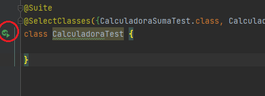
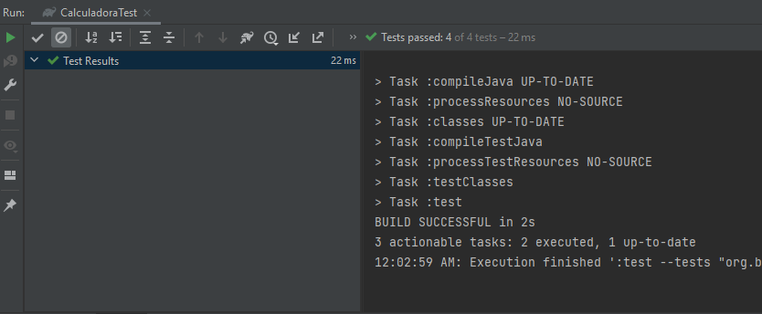

## Ejemplo 03: Suites de pruebas

### OBJETIVO

- Crear una prueba que valide el correcto funcionamiento de una clase o componente.
- Simular el funcionamiento de una clase que aún no existe, usando un mock creado con Mockito.


### DESARROLLO

Cuando comenzamos a desarrollar un número de pruebas, en algunas ocasiones querremos agruparlas de una forma lógica en la que tengan sentido y ejecutarlas en conjunto y de forma independiente a las demás pruebas que podemos tener en el sistema. A esta agrupación lógica de pruebas se le conoce con el nombre de **Suite de pruebas**

JUnit proporciona las siguientes anotaciones para crear conjuntos de pruebas:

- `@Suite`: Indica que la clase en la que se coloca la anotación servirá como una clase de "configuración" para la suite de pruebas. Junto con esta anotación debe colocarse alguna de las siguientes.
- `@SelectPackages`: Indica en qué paquete se encuentran las clases que queremos que se ejecuten como parte de la suite de pruebas.
- `@SelectClasses`: Indica qué clases son las que se ejecutarán como parte de la suite de pruebas.

Para definir una suite de prueba debemos elegir una de las dos últimas anotaciones anteriores y colocarla, con sus valores respectivos, en una clase vacía. No es necesario que esta clase tenga ningún código, ya que su único objetivo es que tengamos un lugar para colocar la anotación.


#### Implementación

Para incluir las suites de pruebas en el proyecto debemos agregar una dependencia adicional en el archivo `build.grade`:

```groovy
dependencies {
    testImplementation 'org.junit.jupiter:junit-jupiter-api:5.8.2'
    testImplementation 'org.junit.jupiter:junit-jupiter-engine:5.8.2'
    implementation 'org.junit.platform:junit-platform-suite-engine:1.8.2'
}

test {
    useJUnitPlatform()
}
```

Para este ejercicio modificaremos la clase de prueba de la calculadora del primer ejercicio. Dejaremos esta clase vacía y crearemos una clase especial para validar cada una de las operaciones. Así que al final tendremos 5 clases.

La primera será para la operación de **suma**:

```java

class CalculadoraSumaTest {

    static Calculadora calculadora;

    @BeforeAll
    static void setup() {
        calculadora = new Calculadora();

    }

    @Test
    @DisplayName("Prueba suma")
    void sumaTest() {
        int esperado = 5;
        assertEquals(esperado, calculadora.suma(3, 2));
    }
}
  
```

La segunda será para la operación de **resta**:


```java

class CalculadoraRestaTest {

    static Calculadora calculadora;

    @BeforeAll
    static void setup() {
        calculadora = new Calculadora();

    }

    @Test
    @DisplayName("Prueba resta")
    void restaTest() {
        int esperado = 1;
        assertEquals(esperado, calculadora.resta(3, 2));
    }
}

```

La tercera para la operación de **multiplicación**:

```java

class CalculadoraMultiplicaTest {

    static Calculadora calculadora;

    @BeforeAll
    static void setup() {
        calculadora = new Calculadora();
    }

    @Test
    @DisplayName("Prueba multiplicación")
    void multiplicaTest() {
        int esperado = 6;
        assertEquals(esperado, calculadora.multiplica(3, 2));
    }
}

```

La cuarta para la operación de **división**:

Y finalmente la quinta clase. Esta será la que usaremos para crear la suite de pruebas y en la que indicaremos qué clases serán las que incluiremos en el el conjunto. Para eso usaremos una clase que no tendrá ningún contenido y pondremos, además de la anotación `@Suite` que es obligatoria, la anotación `@SelectClasses` en la cual pasaremos como valor un arreglo con todas las clases que queremos que se incluyan en el conjunto de pruebas. Que para este ejemplo son las cuatro que ya hemos creado:

```java

@Suite
@SelectClasses({CalculadoraSumaTest.class, CalculadoraRestaTest.class, CalculadoraMultiplicaTest.class, CalculadoraDivideTest.class})
class CalculadoraTest {

}

```


Ejecuta la prueba haciendo clic derecho sobre el editor de código y seleccionando la opción `Run CalculadoraTest` o haciendo clic sobre las dos flechas verdes que aparecen junto al nombre de la clase:



Debes ver el siguiente resultado en la consola del IDE:


