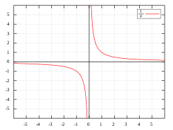
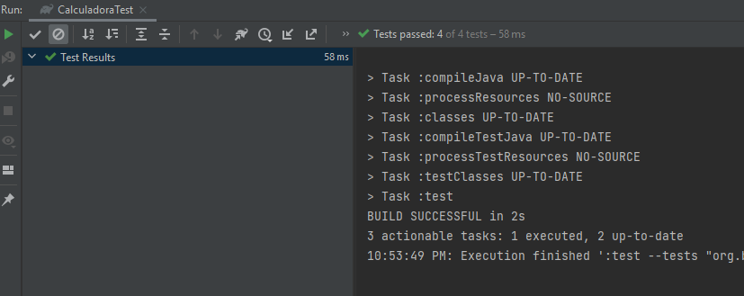

## Reto 01: Prueba de Exceptions

### 🎯 OBJETIVO

- Realizar una prueba unitaria que se encargue de validar que al momento de validar una funcionalidad, se lanza la excepción esperada.

### DESARROLLO

Al momento de mostrar una demo de nuestra calculadora al cliente, este quedó maravillado de su correcto funcionamiento y la ejecución correcta de todas las operaciones que nos pidió realizar durante la demo. Sin embargo, notó que al momento de realizar la implementación de la calculadora omitimos una operación que para él es esencial en sus operaciones diarias: la división. Tu reto será arreglar este terrible error que hemos cometido al entregar una aplicación incompleta al cliente.

La división es una de las cuatro operaciones básicas de la aritmética que consiste en averiguar cuántas veces un número (divisor) está contenido en otro número (dividendo). Sin embargo, y a diferencia de las otras tres operaciones, la división presenta una complicación. Existe un valor que podemos asignar al divisor y que causa que la división explote al encontrar una singularidad espacial en un punto importante el cual podemos ver en la siguiente imagen:




En matemáticas, la división entre cero es una división en la que el divisor es igual a cero, y que no tiene un resultado bien definido. En aritmética y álgebra, es considerada una *indefinición*, y su mal uso puede dar lugar a aparentes paradojas matemáticas.

Como queremos evitarle molestias a nuestro cliente y demostrarle que nuestra calculadora está preparada para todos los posibles valores que le ingresemos debes validar, en una prueba unitaria desarrollada usando JUnit, que si intentamos realizar una división entre cero se lanzará una excepción de tipo "IllegalArgumentException" con el mensaje mostrado a continuación:


```java
    public float divide(float a, float b){

        if(b == 0){
            throw new IllegalArgumentException("No es posible dividir un valor entre 0");
        }

        return a / b;
    }
```

¡Buena suerte!


<details>
  <summary>Solución</summary>

Agregamos el método de prueba en la clase `CalculadoraTest` siguiendo la misma estructura que para el resto de los métodos:

```java

  @Test
  @DisplayName("Prueba división")
  void divideTest() {
    
  }
```

La solución al reto puede hacerse de dos formas. En la primera debemos hacerlo en dos pasos. Primero, usamos el método `assertThrows` para indicar que esperamos que la invocación al método `divide` lance una excepción. Este método recibe dos parámetros, en el primero debemos indicar la clase de la excepción. En el segundo parámetro usaremos una función lambda para realizar la invocación al método que estamos probando. El llamado a `assertThrows` regresará la excepción lanzada por el método:

```java
  @Test
  @DisplayName("Prueba división")
  void divideTest() {
  
    Throwable exception = assertThrows(IllegalArgumentException.class, () -> calculadora.divide(100, 0));

 }
```

El segundo paso consiste en obtener el mensaje (el texto) de la excepción para comprobar que es el mismo texto que estamos esperando. Por lo que la prueba completa queda de la siguiente forma:

```java
    @Test
    @DisplayName("Prueba división")
    void divideTest() {
        Throwable exception = assertThrows(IllegalArgumentException.class, () -> calculadora.divide(100, 0));

        assertEquals("No es posible dividir un valor entre 0", exception.getMessage());
    }
```

La segunda forma de implementar la solución nos permite usar una versión sobrecargada de `assertThrows` que recibe como tercer parámetro el mensaje que estamos esperando obtener:

```java
    @Test
    @DisplayName("Prueba división")
    void divideTest() {
        assertThrows(IllegalArgumentException.class, () -> calculadora.divide(100, 0), "No es posible dividir un valor entre 0");
    }
```

Al ejecutar la prueba anterior debes obtener el siguiente mensaje indicando que la prueba fue satisfactoria y que el cliente finalmente nos pagará por nuestra aplicación:




</details>