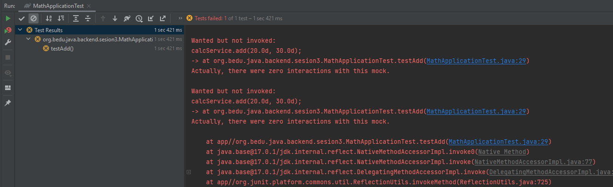

## Reto 02: Prueba de Exceptions

### 🎯 OBJETIVO

- Realizar una prueba unitaria con un doble de pruebas y validar que los métodos adecuados se hayan ejecutado.

### DESARROLLO

El cliente tiene grandes ideas para la calculadora que hemos desarrollado. Justo ahora nos ha pedido el integrarla en un nuevo proyecto para llevar la calculadora a la nube y liberarla como parte de un servicio de matemáticas, por el cual cobrará una subscripción anual y con eso se volverá millonario. Como primer paso te ha pedido definir una interface para que sus ingenieros, graduados del MIT, puedan trabajar en cómo será la integración del misma en su costosa arquitectura orientada a microservicios. Tu no lo recuerdas, pero pasaste las últimas tres noches trabajando en el diseño de la siguiente interface:

```java

public interface CalculadoraService {

    public double add(double input1, double input2);

    public double subtract(double input1, double input2);

    public double multiply(double input1, double input2);

    public double divide(double input1, double input2);
}

```

Como el cliente gastó casi todo el presupuesto en marketing, el único trabajo que los ingenieros del MIT pudieron hacer fue tomar tu interfaz y colocarla dentro de la clase principal de la aplicación de matemáticas, de esta forma:

```java

public class MathApplication {
    private CalculadoraService calcService;

    public double add(double input1, double input2){
        return input1 + input2;
    }

    public double subtract(double input1, double input2){
        return calcService.subtract(input1, input2);
    }

    public double multiply(double input1, double input2){
        return calcService.multiply(input1, input2);
    }

    public double divide(double input1, double input2){
        return calcService.divide(input1, input2);
    }
}

```

Al revisar la implementación te das cuenta de que hay algo mal con la aplicación anterior; tu aunque no tienes dudas, tampoco tienes pruebas de esto. Se lo comunicas al cliente pero él confía en que el trabajo que le entregaron es correcto y que si algo está fallando debe ser porque no estuvo definido dentro de tu interface. Tu labor en este reto consistirá en realizar una prueba sobre la clase anterior y demostrar que en su implementación no en todos los casos se usa la interface que definiste, para eso deberás crear un doble de pruebas de `CalculatorService` y verificar si efectivamente hace uso de esta para todas las operaciones.

¡Buena suerte!


<details>
  <summary>Solución</summary>

Lo primero es crear una nueva clase de pruebas, crear un mock de `CalculatorService` usando Mockito e inyectarlo en una instancia de `MathApplication`:

```java

@ExtendWith(MockitoExtension.class)
public class MathApplicationTest {
	
   @Mock
   CalculadoraService calcService;

   @InjectMocks 
   MathApplication mathApplication;
}
```

El segundo paso es crear el método que se encargará de probar la clase:

```java
    @Test
    public void testAdd() {

    }
```

A continuación defines el comportamiento del mock. Cuando se invoque el método `add` con dos enteros, debe regresar como resultado la suma de esos dos enteros:

```java
    @Test
    public void testAdd() {

        when(calcService.add(10.0, 20.0)).thenReturn(30.00);
    }
```

Por último, se ejecutará el método `add` de `mathApplication` y se verificará que al final de la prueba se haya invocado también el método `add` de tu interface de la calculadora:

```java
    @Test
    public void testAdd() {

        when(calcService.add(10.0, 20.0)).thenReturn(30.00);

        assertEquals(mathApplication.add(10.0, 20.0), 30.0, 0);

        verify(calcService).add(20.0, 30.0);
    }
```

El último paso es ejecutar la prueba y comprobar si efectivamente, y como efecto de las desveladas, olvidaste agregar un método para suma en tu interface o si por el contrario los ingenieros del MIT decidieron tomar un atajo para terminar antes su trabajo. Respiras profundo y con tu mano temblorosa ejecutas la prueba y observas que el resultado es.... un error, pero, ¿en dónde?



Al revisar la salida de la consola te das cuenta de que, efectivamente, no usaron el método que definiste (y que como está en el doble de prueba de `CalculadoraService` puedes demostrar que sí lo definiste). Así que ya tienes las pruebas. Recuperas la confianza del cliente y este te da lo último del presupuesto (y que olvidó que tenía) para que arregles el error en la implementación anterior y logren liberar finalmente el servicio.


</details>