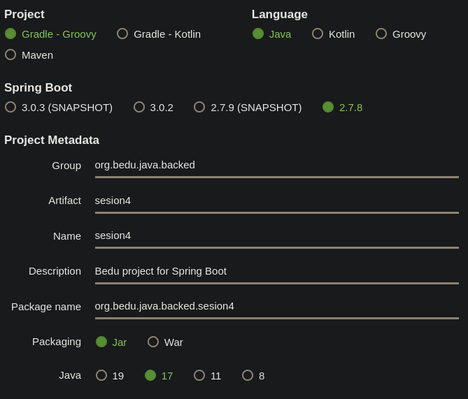
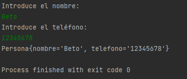

## Sesión 4: Aplicación de línea de comandos

### 🎯 OBJETIVO

- Implementar una aplicación de línea de comandos utilizando Spring Boot

### DESARROLLO

Dentro de las muchas bondades con las que cuenta en Framework de Spring, y en particular Spring Boot, se encuentra la opción de poder ejecutar comandos al momento de iniciar la aplicación. Gracias a esto puedes proporcionar algunas instrucciones, rutas, o valores particulares a tu aplicación.

En este postwork deberás implementar la interface `CommandLineRunner` que proporciona Spring Boot, para que por medio de línea de comandos solicite dos valores y los establezca como atributos de una clase `Persona`. 

Recuerda que para leer datos a través de una línea de comandos se utiliza la clase `Scanner` del paquete `java.util`.

Recuerda que en el archivo de configuración de Gradle debes agregar la siguiente línea:

```groovy
bootRun {
  standardInput = System.in
}
```
<details>
  <summary>Solución</summary>

  
Crea un proyecto usando Spring Initializr desde el IDE IntelliJ Idea como lo hiciste en la primera sesión. Selecciona las siguientes opciones:

    Grupo, artefacto y nombre del proyecto.
    Tipo de proyecto: **Gradle**.
    Lenguaje: **Java**.
    Forma de empaquetar la aplicación: **jar**.
    Versión de Java: **11** o superior.



En la siguiente ventana no selecciones ninguna dependencia; no las necesitaremos en este proyecto. Presiona el botón `Finish`.

Crea un nuevo paquete llamado `model` y dentro crea una clase `Persona`. Esta clase debe tener dos atributos de tipo `String`, un `nombre` y un `telefono`:

```java
public class Persona {
    private String nombre;
    private String telefono;
}
```

Agrega los métodos **setter** y **getter** de los atributos. Agrega también dos constructores, uno que no reciba ningún parámetro y otro que reciba los dos valores anteriores. También, sobreescribe el método `toString` para mostrar estos valores. Esto ayudará al momento de mostrar los valores de la instancia de `Persona` en la línea de comandos:

```java
public class Persona {
    private String nombre;
    private String telefono;

    public Persona() {
    }

    public Persona(String nombre, String telefono) {
        this.nombre = nombre;
        this.telefono = telefono;
    }

    public String getNombre() {
        return nombre;
    }

    public void setNombre(String nombre) {
        this.nombre = nombre;
    }

    public String getTelefono() {
        return telefono;
    }

    public void setTelefono(String telefono) {
        this.telefono = telefono;
    }

    @Override
    public String toString() {
        return "Persona{" +
                "nombre='" + nombre + '\'' +
                ", telefono='" + telefono + '\'' +
                '}';
    }
}

```

Spring Initializr crea de forma automática una clase con el mismo nombre del proyecto y el postfijo `Application`, `SolucionApplication` en este ejemplo. Esa clase estará decorada con la anotación `@SpringBootApplication`. Modifica esta clase para hacer que implemente la interface `CommandLineRunner`

```java
@SpringBootApplication
public class SolucionApplication implements CommandLineRunner {

    public static void main(String[] args) {
        SpringApplication.run(SolucionApplication.class, args);
    }
}
```

`CommandLineRunner` contiene un solo método el cual se ejecuta al momento de iniciar la aplicación. Es dentro de este método donde deberás colocar el código de la aplicación.

```java
@Override
public void run(String... args) throws Exception {

}
```

En el cuerpo de `run` usa una instancia de `Scanner` para leer la entrada que el usuario proporcione a través de la entrada estándar (el teclado). Aquí deberás leer el texto introducido y luego usarlo para establecer los valores de los atributos de `Persona`.

```java
@SpringBootApplication
public class SolucionApplication implements CommandLineRunner {

    public static void main(String[] args) {
        SpringApplication.run(SolucionApplication.class, args);
    }

    @Override
    public void run(String... args) throws Exception {
         Scanner reader = new Scanner(System.in);

        System.out.println("Introduce el nombre: ");
        String nombre = reader.nextLine();

        System.out.println("Introduce el teléfono: ");
        String telefono = reader.nextLine();
    }
}

```

Ahora usa los valores anteriores para crear una nueva instancia de `Persona` usando el constructor que recibe ambos, y luego imprime el objeto creado:

```java
   @Override
    public void run(String... args) throws Exception {
        Scanner reader = new Scanner(System.in);

        System.out.println("Introduce el nombre: ");
        String nombre = reader.nextLine();

        System.out.println("Introduce el teléfono: ");
        String telefono = reader.nextLine();

        Persona persona = new Persona(nombre, telefono);

        System.out.println(persona);
    }
```

Ejecuta la aplicación. Si lo haces desde IntelliJ Idea deberás hacer clic en la consola y comenzar a escribir cuando se soliciten los datos:




La aplicación se detendrá de forma automática cuando el resultado se imprima en pantalla.

</details>