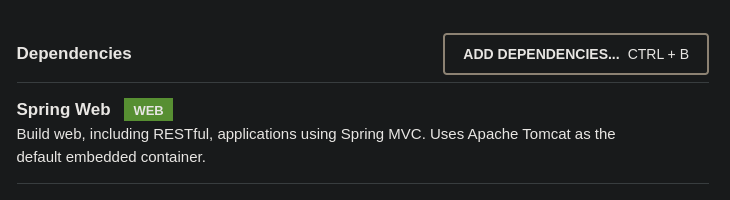

## Reto 02: Controladores con Spring MVC con parámetros

### OBJETIVO

- Aprender la forma de crear controladores de Spring usando su módulo web (Spring MVC) y recibir un parámetro.
- Crear un servicio REST que regrese un recurso dinámico.
- Consumir el servicio usando un navegador Web y con Postman.

### DESARROLLO

En el ejemplo anterior creamos un controlador que regresaba un mensaje estático predeterminado, lo que quiere decir que no importa cuantas veces llamemos al recurso siempre recibimos la misma respuesta. 

En este reto tendrás que modificar el controlador creado en el ejemplo anterior para que reciba un parámetro que interpretará como el nombre de la persona a la que estamos saludando. El objetivo es poder saludar a un usuario usando su nombre, por lo que la salida deberá ser similar a la siguiente:


Deberás validar el correcto funcionamiento de la aplicación usando la herramienta Postman y desde el navegador.

¡Buena suerte!


<details>
  <summary>Solución</summary>

Lo primero es crear un proyecto usando Spring Initializr desde el IDE IntelliJ Idea. Selecciona las siguientes opciones:

    Grupo, artefacto y nombre del proyecto.
    Tipo de proyecto: **Gradle**.
    Lenguaje: **Java**.
    Forma de empaquetar la aplicación: **jar**.
    Versión de Java: **11** o superior.


En la siguiente ventana elige Spring Web como la única dependencia del proyecto:



Presiona el botón `Finish`.

Dentro del paquete del proyecto crearemos un subpaquete que contendrá los controladores de Spring MVC (los componentes que reciben y manejan las peticiones web dentro de la aplicación).

Haz clic con el botón derecho del ratón sobre el paquete y en el menú que se muestra selecciona las opciones `New  -> Package`. Dale a este nuevo paquete el nombre de `controllers`.


Crea un segundo paquete llamado `model` a la misma altura que el paquete `controllers`. Al final debes tener dos paquetes adicionales:


Dentro del paquete `model` crea una nueva clase llamada `Saludo`. Esta clase representará el modelo de los datos que regresará el servicio que crearemos en un momento. Esta será una clase sencilla que tendrá dos propiedades de tipo `String`: `mensaje` y `nombre`. Además de sus métodos *setter* y su método *getter*:    

```java
public class Saludo {
    private String mensaje;
    private String nombre;

    public String getMensaje() {
        return mensaje;
    }

    public void setMensaje(String mensaje) {
        this.mensaje = mensaje;
    }

    public String getNombre() {
        return nombre;
    }

    public void setNombre(String nombre) {
        this.nombre = nombre;
    }
}
```

En el paquete `controller` crea una nueva clase llamada `SaludoController`. Esta clase implementará los servicios web REST que manejan a los recursos de tipo `Saludo`. Para indicar a Spring que este componente es un servicio REST debemos decorar la case con la anotación `@RestController`:

```java
@RestController
public class SaludoController {

}
```

Esta clase tendrá, en este momento, un  solo método o manejador de llamadas, el cual no recibirá ningún parámetro y regresará un recurso de tipo `Saludo` con un mensaje preestablecido.

```java
    public Saludo saluda(){

      Saludo saludo = new Saludo();
      saludo.setMensaje("¡¡Hola Mundo!!");
      saludo.setNombre(nombre);

      return saludo;
    }
```

Para indicar que este método es un manejador de peticiones debemos indicar qué tipo de operaciones manejará (el verbo HTTP que soportará). Como en este caso solo se usará para leer información estática se usará el verbo **GET**. Spring en su módulo web (Spring MVC) proporciona una serie de anotaciones que permite indicar esto de una forma sencilla. En este caso la anotación que se usrá es `@GetMapping` a la cual hay que indicarle la URL de las peticiones que manejará. En este caso será la ruta `saludo`. El método completo queda de la siguiente forma:

```java
     @GetMapping("/saludo/{nombre}")
    public Saludo saluda(@PathVariable String nombre){

        Saludo saludo = new Saludo();
        saludo.setMensaje("¡¡Hola Mundo!!");
        saludo.setNombre(nombre);

        return saludo;
    }
```

Ejecuta la aplicación, en la consola del IDE debes ver un mensaje similar al siguiente:


Esto quiere decir que la aplicación se ejecutó correctamente y todo está bien configurado.

Desde tu navegador entra en la siguiente ruta: [http://localhost:8080/saludo/beto](http://localhost:8080/saludo/beto). Debes ver una salida similar a la siguiente:


Dependiendo de tu navegador y de los plugins que tengas instalado, podrías ver el formato un poco diferente; lo importante es que veas el texto "**¡¡Hola Mundo!!**".

Esto quiere decir que la aplicación ha funcionado de forma correcta.

Ahora, consumiremos el servicio usando *Postman. Al abrir Postman debes ver una ventana similar a la siguiente:


Haz clic en la opción *Create a basic request*. En la siguiente ventana coloca la misma URL de la petición que usaste en el navegador y presiona el botón `Send`. Una vez que recibas la respuesta, debes ver una salida similar en el panel de respuestas:


</details>