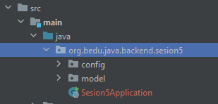

## Ejemplo 01: Definición y configuración explícita de Beans

### OBJETIVO

- Crear un Bean de Spring de forma explícita.
- Inyectar el Bean creado en otras clases para su uso.


### DESARROLLO

Crea un proyecto usando Spring Initializr desde el IDE IntelliJ con las siguientes opciones:

  - Gradle Proyect (no te preocupes, no es necesario que tengas Gradle instalado).
  - Lenguaje: **Java**.
  - Versión de Spring Boot, la versión estable más reciente
  - Grupo, artefacto y nombre del proyecto.
  - Forma de empaquetar la aplicación: **jar**.
  - Versión de Java: **11** o superior.


No selecciones ninguna dependencia, no las necesitaremos en este ejemplo.

Presiona el botón "Finish".

Ahora, crea dos paquetes dentro de la estructura creada por IntelliJ. El primer paquete se llamará `model` y el segundo `config`:



Dentro del paquete `model` crea una nueva clase llamada `Saludo`. Esta representa al Bean que inyectaremos más adelante en este ejemplo:

```java
public class Saludo {
    private final String nombre;

    public Saludo(String nombre) {
        this.nombre = nombre;
    }

    public String getNombre() {
        return nombre;
    }
}
```

Fíjate como `Saludo` tiene una sola propiedad llamada `nombre` que hemos marcado como `final`. Esto quiere decir que una vez que se establezca el valor de esa propiedad no podrá ser modificado. Aunque esto no es obligatorio sí es una buena práctica.

También, creamos un constructor que permita inicializar el valor de `nombre` y un `getter`. Debido a que el valor de `nombre` no puede ser cambiado una vez que se ha establecido, no es necesario proporcionar un `setter`.

Dentro del paquete `config` crea una clase llamada `SaludoConfig`. Esta clase es la que usaremos para configurar el Bean que se usará en la aplicación. Como esta es una clase de **configuración** debemos decorarla con la anotación `@Configuration`, de esta forma le indicamos a Spring que esta clase se usará para la creación (o modificación) de beans dentro de la aplicación:

```java
@Configuration
public class SaludoConfig {

}
```

A continuación, declaramos nuestro primer Bean de forma explícita. Para ello hacemos uso de la anotación `@Bean` dentro de un método que, por convención, tendrá el mismo nombre del Bean que crearemos; en este caos será `saludo`:

```java
@Bean
public Saludo saludo(){

}
```

Crear e inicializar nuestro bean dentro de este método es muy sencillo, simplemente regresamos una nueva instancia de `Saludo`:

```java
@Bean
public Saludo saludo(){
  return new Saludo("Beto");
}
```

Con esto le estamos proporcionando a Spring, de forma **explícita**, el Bean que usará cada vez que alguna clase necesite una instancia de `Saludo`. También, estamos inicializando el valor de su propiedad `nombre` de forma explícita a `Beto`.

Hagamos uso de esta Bean en otra parte de nuestra aplicación.

vamos a la clase principal, `Sesion5Application`, la cual está decorada con la anotación `@SpringBootApplication`. Es en esta clase donde le indicaremos a Spring que debe inyectar la instancia de `Saludo`. Para eso declararemos un atributo de tipo `Saludo`, de la siguiente forma:

```java
@SpringBootApplication
public class Sesion5Application {

    private Saludo saludo;
    
    public static void main(String[] args) {
        SpringApplication.run(Sesion5Application.class, args);
    }   
}
```

Antes de ver cómo indicarle a Spring que debe inyectar esta nueva instancia, mostraremos como comprobar que Spring está efectívamente inyectando el Bean, lo primero que haremos es hacer que `Sesion5Application` implemente la interface `CommandLineRunner`, y en su método `run` imprimiremos el valor del atributo `nombre` de saludo:

```java
@SpringBootApplication
public class Sesion5Application implements CommandLineRunner {

    private Saludo saludo;

    public static void main(String[] args) {
        SpringApplication.run(Sesion5Application.class, args);
    }


	@Override
	public void run(String... args) throws Exception {
		System.out.println(saludo.getNombre());
	}
}
```

Ahora sí, le indicaremos a Spring que debe inyectar la instancia. Lo veremos de tres formas, las dos primeras son maneras que funcionan pero no son muy recomendadas (anque tal vez los veas en muchos tutoriales), la tercera es la forma que sigue la mejor práctica para la inyección de estas instancias.

En la primera forma, colocamos la anotación `@Autowired` directamente en la declaración de la instancia de `Saludo`, de esta forma:

```java
@Autowired
private Saludo saludo;
```

Si ahora ejecutamos la aplicación, debemos obtener la siguiente salida en la consola:


La primera forma funciona, pero no es recomendada. El problema es que el atributo `Saludo` tiene un nivel de acceso `private` (lo cual sigue las mejores prácticas de la encapsulación), esto quiere decir que Spring debe primero modificar el nivel de acceso de este atributo, inyectar el valor, y luego volver a regresar su nivel de acceso original. Esto, además de que es un problema potencial de seguridad, también hace que la inicialización se más lenta.

Veamos la segunda forma de indicar a Spring que inyecte la instancia. Para esto, creamos un método `setter` para `saludo`, y movemos la anotación `@Autowired` a este método:

```java
    private Saludo saludo;

    @Autowired
    public void setSaludo(Saludo saludo) {
        this.saludo = saludo;
    }
```

Si ejecutamos nuevamente la aplicación, debemos ver la misma salida en la consola. 


Esta segunda forma es mucho mejor que la primera, ya que permitimos que Spring haga uso del `setter` correspondiente para inyectar la instancia, y de esta forma no se mete con los modificadores de acceso que estemos usando. Sin embargo, hay un problema, ya que ahora permitimos que alguna otra clase modifique en cualquier momento la instancia de `Saludo` que estamos usando. Esto, en algunos casos, puede ser algo que estemos buscando, pero en la mayoría de las ocasiones buscamos asegurar que siempre usemos una misma única instancia, y que una vez que esta se ha inyectado no sea modificado. 

Para solucionar este problema, usaremos una tercera forma de inyectar la instancia de `Saludo`, y para ello declararemos un constructor de `Sesion5Application` que reciba la instancia correspondiente. Es en este constructor donde declararemos, usando `@Autowired`, que Spring debe inyectar la instancia de `Saludo`. Podemos hacerlo de dos formas, a nivel de constructor:

```java
    @Autowired
    public Sesion5Application(Saludo saludo) {
        this.saludo = saludo;
    }
```

o a nivel de parámetro:

```java
public Sesion5Application(@Autowired Saludo saludo) {
  this.saludo = saludo; 
}
```

Para este caso, las dos formas son equivalentes. 

Gracias a esto ahora podemos declarar la instancia de `Saludo` como `final`, y de esa forma asegurar que no será modificada posteriormente:

```java
    private final Saludo saludo;

    public Sesion5Application(@Autowired Saludo saludo) {
        this.saludo = saludo;
    }
```

Si volvemos a ejecutar la aplicación, veremos que obtenemos la misma salida.


Esta tercera forma es la recomandada para inyectar los Beans dentro de las distintas clases de nuestra aplicación.