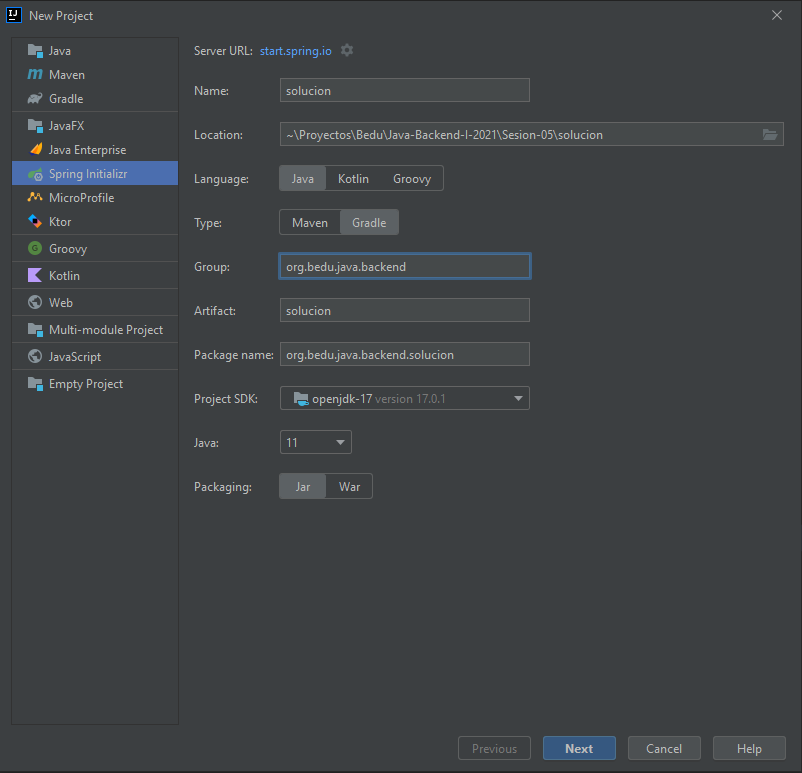
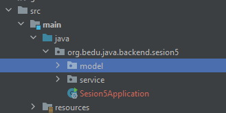
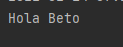

## Ejemplo 02: Configuración implícita de Beans para inyección de dependencias.

### OBJETIVO

- Crear un Bean de Spring de forma implícita.
- Inyectar el Bean creado en otras clases para su uso.


### DESARROLLO

Crea un proyecto usando Spring Initializr desde el IDE IntelliJ con las siguientes opciones:

  - Gradle Proyect (no te preocupes, no es necesario que tengas Gradle instalado).
  - Lenguaje: **Java**.
  - Versión de Spring Boot, la versión estable más reciente
  - Grupo, artefacto y nombre del proyecto.
  - Forma de empaquetar la aplicación: **jar**.
  - Versión de Java: **11** o superior.



No selecciones ninguna dependencia, no las necesitaremos en este ejemplo.

Presiona el botón "Finish".

Ahora, crea dos paquetes dentro de la estructura creada por IntelliJ. El primer paquete se llamará `model` y el segundo `service`:



Dentro del paquete `model` crea una nueva clase llamada `Saludo`. Esta representa al Bean que inyectaremos más adelante en este ejemplo:

```java
public class Saludo {
    private final String nombre;

    public Saludo() {
        this.nombre = "Beto";
    }

    public String getNombre() {
        return nombre;
    }
}
```

Fíjate como `Saludo` tiene una sola propiedad llamada `nombre` que hemos marcado como `final`. Esto quiere decir que una vez que se establezca el valor de esa propiedad no podrá ser modificado. Aunque esto no es obligatorio sí es una buena práctica. 

También, creamos un constructor en donde inicializamos el valor de `nombre` a un valor fijo. También tenemos el método `getter` de `nombre`. Debido a que el valor de `nombre` no puede ser cambiado una vez que se ha establecido, no es necesario proporcionar un `setter`.

Como queremos que `Saludo` sea manejado como un Bean de Spring, demos indicarlo de alguna forma. Para ello usaremos una de las anotaciones de estereotipos de Spring: `@Component`. Esta anotación nos ayuda a indicar que queremos que Spring gestione las instancias de `Saludo` y que las inyecte en los lugares donde la necesitemos.

Dentro del paquete `service` crea una clase llamada `SaludoService`. Esta clase será en la que inyectaremos la instancia de `Saludo`. Como esta clase será interpretada como un **servicio** debemos decorarla con la anotación `@Service`, otra de las anotaciones de estereotipos de Spring:

```java
@Service
public class SaludoService {

}
```

A continuación, indicamos que este servicio usará una instancia de `Saludo` y que Spring debe inyectarlo (ya que `Saludo` ahora es una clase manejada por Spring). Para eso repetimos la fórmula del ejemplo anterior: Colocamos un referencia a una instancia de `Saludo` y un constructor que reciba esta instancia, decoramos el constructor con `@Autowired`:

```java
@Service
public class SaludoService {

    private final Saludo saludo;

    @Autowired
    public SaludoService(Saludo saludo) {
        this.saludo = saludo;
    }
}
```

Para terminar con `SaludoService`, agregamos un método `saluda` que haga uso de esta instancia:

```java
public String saluda(){
  return "Hola " + saludo.getNombre();
}
```

Hagamos uso de esta Bean en otra parte de nuestra aplicación.

vamos a la clase principal, `Sesion5Application`, la cual está decorada con la anotación `@SpringBootApplication`. Es en esta clase donde le indicaremos a Spring que debe inyectar la instancia de `SaludoService`. Para eso declararemos un atributo de tipo `SaludoService`, de la misma forma que en el ejemplo anterior:

```java
@SpringBootApplication
public class Sesion5Application {

   private final SaludoService saludoService;

    public Sesion5Application(@Autowired SaludoService saludoService) {
        this.saludoService = saludoService;
    }
}
```

Haremos es hacer que `Sesion5Application` implemente la interface `CommandLineRunner`, y en su método `run` imprimiremos el valor del atributo `nombre` de saludo, usando la instancia de `SaludoService`:

```java
@SpringBootApplication
public class Sesion5Application implements CommandLineRunner {

    private final SaludoService saludoService;

    public Sesion5Application(@Autowired SaludoService saludoService) {
        this.saludoService = saludoService;
    }

    public static void main(String[] args) {
        SpringApplication.run(Sesion5Application.class, args);
    }


    @Override
    public void run(String... args) throws Exception {
        System.out.println(saludoService.saluda());
    }
}

```

Si ahora ejecutamos la aplicación, debemos obtener la siguiente salida en la consola:



