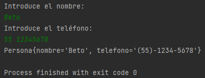

## Sesión 5: Inversión de Control (IoC) en Spring Boot

### 🎯 OBJETIVO

- Extender el programa de línea de comandos para utilizar el IoC de Spring Boot

### DESARROLLO

En el Postwork de la sesión anterior implementamos una línea de comandos que solicitaba un nombre y número de teléfono y los usaba para construir una nueva instancia de una clase `Persona`. En esta ocasión tu misión será extender este programa para que la línea de comandos para que:

1. Valide que el número de teléfono solo contenga caracteres válidos: números, guion medio y espacio en blanco.
1. Valide que el número de teléfono contenga 10 dígitos.
1. Si se tiene un número válido, elimine todos los caracteres que no sean numéricos.
1. De al número de teléfono un formato de (##)-####-#### antes de imprimirlo en la consola.

Dicha implementación debe estar contenida en dos clases “servicio” que deben ser inyectada en la clase principal.

Recuerda que deberás implementar la interface `CommandLineRunner` que proporciona Spring Boot, para que por medio de línea de comandos reciba una cadena de texto y que para leer datos a través de una línea de comandos se utiliza la clase `Scanner` del paquete `java.util`.

Además, en el archivo de configuración de Gradle debes agregar la siguiente línea:

```groovy
bootRun {
  standardInput = System.in
}

```
<details>
  <summary>Solución</summary>

  
Crea un proyecto usando Spring Initializr desde el IDE IntelliJ Idea como lo hiciste en la primera sesión. Selecciona las siguientes opciones:

    Grupo, artefacto y nombre del proyecto.
    Tipo de proyecto: **Gradle**.
    Lenguaje: **Java**.
    Forma de empaquetar la aplicación: **jar**.
    Versión de Java: **11** o superior.


En la siguiente ventana no selecciones ninguna dependencia; no las necesitaremos en este proyecto. Presiona el botón `Finish`.

Crea dos paquetes, un paquete `model` y un paquete `service`. Dentro del paquete `service` replica la clase `Persona` que creamos en el módulo anterior.

```java
public class Persona {
    private String nombre;
    private String telefono;

    public Persona() {
    }

    public Persona(String nombre, String telefono) {
        this.nombre = nombre;
        this.telefono = telefono;
    }

    public String getNombre() {
        return nombre;
    }

    public void setNombre(String nombre) {
        this.nombre = nombre;
    }

    public String getTelefono() {
        return telefono;
    }

    public void setTelefono(String telefono) {
        this.telefono = telefono;
    }

    @Override
    public String toString() {
        return "Persona{" +
                "nombre='" + nombre + '\'' +
                ", telefono='" + telefono + '\'' +
                '}';
    }
}
```

En el paquete `service` crea una clase `ValidadorTelefono` y coloca dos métodos, inicialmente vacíos. El primero validará que el teléfono contenga solo caracteres válidos, con esto le permitiremos al cliente que introduzca el número de teléfono usando el formato que le sea más conveniente; incluso podría copiarlo y pegarlo desde donde lo tenga guardado. El segundo método eliminará todos los caracteres no numéricos del teléfono proporcionado por el usuario; esto lo usaremos para que, independientemente del formato que el cliente haya usado, podamos darle nuestro propio formato antes de imprimirlo.

```java
public class ValidadorTelefono {
   
    public boolean isValido(String telefono) {
    }

    public String limpiaNumero(String telefono){
    }
}
```

Comencemos implementando `isValido`. Para facilitar la implementación de este método usaremos una expresión regular la cual validará el uso de los caracteres permitidos y la longitud del número. Como siempre usaremos la misma expresión podemos colocarla como una constante y en el método solo validar que la cadena cumpla con la expresión:

```java
    private static final Pattern PATTERN_TELEFONO = Pattern.compile("^(\\d{2,4}[- .]?){2}\\d{4}$");

    public boolean isValido(String telefono) {
        return PATTERN_TELEFONO.matcher(telefono).matches();
    }
```

El método `limpiaNumero` será de la misma forma muy simple, recibirá el teléfono que hay que limpiar y eliminará todo lo que no sea un número. Para eso también usaremos una expresión regular:

```java
    public String limpiaNumero(String telefono){
        return telefono.replaceAll("[^0-9]", "");
    }
```

Como esta clase será un servicio, hay que decorarla con la anotación `@Service`. La clase completa queda de la siguiente forma:

```java
@Service
public class ValidadorTelefono {

    private static final Pattern PATTERN_TELEFONO = Pattern.compile("^(\\d{2,4}[- .]?){2}\\d{4}$");

    public boolean isValido(String telefono) {
        return PATTERN_TELEFONO.matcher(telefono).matches();
    }

    public String limpiaNumero(String telefono){
        return telefono.replaceAll("[^0-9]", "");
    }
}
```

Ahora, crearemos la clase que representa al servicio encargado de dar el nuevo formato al número de teléfono. En el mismo paquete `service` crea una nueva clase `FormateadorTelefono` con un solo método `formatea`, que recibirá y regresará una cadena. 

```java
public class FormateadorTelefono {
   public String formatea(String telefono) {
   }
}
```

Para implementar el método, nuevamente usaremos dos expresiones regulares, una que tome los elementos del teléfono inicial (el que solo tiene los números) y lo convierta en el formato final. Para los formatos iniciales y finales usaremos dos constantes:


```java
    private static final String FORMATO_INICIAL_TELEFONO = "(\\d{2})(\\d{4})(\\d+)";
    private static final String FORMATO_FINAL_TELEFONO = "($1)-$2-$3";

    public String formatea(String telefono) {
        return String.valueOf(telefono).replaceFirst(FORMATO_INICIAL_TELEFONO, FORMATO_FINAL_TELEFONO);
    }
```

Esta clase también es un servicio, por lo que la decoramos con la anotación `@Service`:

```java
@Service
public class FormateadorTelefono {
    private static final String FORMATO_INICIAL_TELEFONO = "(\\d{2})(\\d{4})(\\d+)";
    private static final String FORMATO_FINAL_TELEFONO = "($1)-$2-$3";

    public String formatea(String telefono) {
        return String.valueOf(telefono).replaceFirst(FORMATO_INICIAL_TELEFONO, FORMATO_FINAL_TELEFONO);
    }
}

```

Spring Initializr creará de forma automática una clase con el mismo nombre del proyecto y el postfijo `Application`, `SolucionApplication` en este ejemplo. Esa clase estará decorada con la anotación `@SpringBootApplication`. 

```java
@SpringBootApplication
public class SolucionApplication implements CommandLineRunner {

    public static void main(String[] args) {
        SpringApplication.run(SolucionApplication.class, args);
    }
}
```

Usaremos la inyección de dependenciasS por medio del constructor de la clase para obtener una instancia de cada una de las clases de nuestros servicios:

```java
@SpringBootApplication
public class SolucionApplication {

    private final ValidadorTelefono validadorTelefono;
    private final FormateadorTelefono formateadorTelefono;

    @Autowired
    public SolucionApplication(ValidadorTelefono validadorTelefono, FormateadorTelefono formateadorTelefono) {
        this.validadorTelefono = validadorTelefono;
        this.formateadorTelefono = formateadorTelefono;
    }
}
```

Ahora modifica esta clase para hacer que implemente la interface `CommandLineRunner`:

```java

@SpringBootApplication
public class SolucionApplication implements CommandLineRunner {

    private final ValidadorTelefono validadorTelefono;
    private final FormateadorTelefono formateadorTelefono;

    @Autowired
    public SolucionApplication(ValidadorTelefono validadorTelefono, FormateadorTelefono formateadorTelefono) {
        this.validadorTelefono = validadorTelefono;
        this.formateadorTelefono = formateadorTelefono;
    }
    
    @Override
    public void run(String... args) throws Exception {

    }
}
```

En el cuerpo de `run` usa una instancia de `Scanner` para leer la entrada que el usuario proporcione a través de la entrada estándar (el teclado).

```java

    @Override
    public void run(String... args) throws Exception {
       Scanner reader = new Scanner(System.in);

        System.out.println("Introduce el nombre: ");
        String nombre = reader.nextLine();

        System.out.println("Introduce el teléfono: ");
        String telefono = reader.nextLine();
    }


```

Ahora usa el primer servicio para validar el teléfono. Si el número no es válido le mostraremos un mensaje de error al usuario:

```java
    @Override
    public void run(String... args) throws Exception {
        Scanner reader = new Scanner(System.in);

        System.out.println("Introduce el nombre: ");
        String nombre = reader.nextLine();

        System.out.println("Introduce el teléfono: ");
        String telefono = reader.nextLine();

        if (validadorTelefono.isValido(telefono)) {
            
        } else {
            System.out.println("Por favor, introduce un número válido");
        }
    }
```

Si el número es válido procedemos a limpiarlo, asignarle el nuevo formato y construir una instancia de `Persona`:

```java
  if (validadorTelefono.isValido(telefono)) {
      telefono = validadorTelefono.limpiaNumero(telefono);
      telefono = formateadorTelefono.formatea(telefono);

      Persona persona = new Persona(nombre, telefono);

      System.out.println(persona);
  }
```

El método completo queda de la siguiente forma:

```java
    @Override
    public void run(String... args) throws Exception {
        Scanner reader = new Scanner(System.in);

        System.out.println("Introduce el nombre: ");
        String nombre = reader.nextLine();

        System.out.println("Introduce el teléfono: ");
        String telefono = reader.nextLine();

        if (validadorTelefono.isValido(telefono)) {
            telefono = validadorTelefono.limpiaNumero(telefono);
            telefono = formateadorTelefono.formatea(telefono);

            Persona persona = new Persona(nombre, telefono);

            System.out.println(persona);
        } else {
            System.out.println("Por favor, introduce un número válido");
        }
    }
```


Ejecuta la aplicación. Si lo haces desde IntelliJ Idea deberás hacer clic en la consola y comenzar a escribir:



La aplicación se detendrá de forma automática cuando el resultado se imprima en pantalla.

</details>