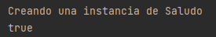

## Reto 01: Cambio de Scope

### OBJETIVO

- Modificar el Scope de un Bean manejado por Spring, para crear diferentes instancias del mismo.

### DESARROLLO

Ahora que logramos que Spring se encargue de manejar los Beans, hay algo más que debes saber. Por default, Spring sólo crea una instancia de cada uno de los Beans que maneja. Esto algunas veces puede ser una ventaja pero otras una desventaja. 

Para comprobar esto, haremos una modificación a la aplicación del Ejemplo 2, agregando un mensaje en el constructor de `Saludo`:

```java
    public Saludo() {
        this.nombre = "Beto";

        System.out.println("Creando una instancia de Saludo");
    }
```

Y ahora, modifica la clase `SaludoService` para agregar una segunda instancia de saludo:

```java
@Service
public class SaludoService {

    private final Saludo saludo;
    private final Saludo otroSaludo;

    @Autowired
    public SaludoService(Saludo saludo, Saludo otroSaludo) {
        this.saludo = saludo;
        this.otroSaludo = otroSaludo;
    }

    public String saluda(){
        return "Hola " + saludo.getNombre();
    }
}
```

Si ejecutas la aplicación, debes ver el siguiente mensaje en la consola:


El primer mensaje aprece entre algunos otros textos de la consola, pero a pesar de que tenemos dos instancias solo hay un mensaje. 

Podemos hacer una segunda prueba para comprobar esto, comparando las dos instancias usando el operador `==`:

```java
    @Autowired
    public SaludoService(Saludo saludo, Saludo otroSaludo) {
        this.saludo = saludo;
        this.otroSaludo = otroSaludo;

        System.out.println(saludo == otroSaludo);
    }
```



Con eso no queda duda de que las dos instancias apuntan al mismo objeto. 

Tu reto consiste en modifcar la forma en la que Spring crea las instancias de `Saludo` para lograr obtener dos instancias diferentes:

¡Buena suerte!


---

### Solución

¡Recuerda intentar resolver el reto antes de ver la solución! Una vez que lo hayas intentado puedes dirijirte al [proyecto con la solución](./solucion).