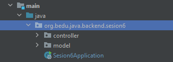
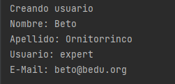
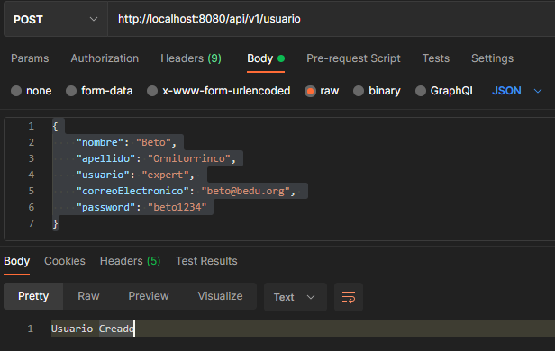
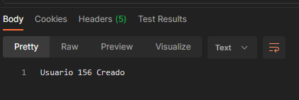

## Ejemplo 01: Parámetros de peticiones HTTP POST y GET

### OBJETIVO

- Recibir un objeto en el cuerpo de una petición HTTP POST


### DESARROLLO

Crea un proyecto usando Spring Initializr desde el IDE IntelliJ con las siguientes opciones:

  - Gradle Proyect (no te preocupes, no es necesario que tengas Gradle instalado).
  - Lenguaje: **Java**.
  - Versión de Spring Boot, la versión estable más reciente
  - Grupo, artefacto y nombre del proyecto.
  - Forma de empaquetar la aplicación: **jar**.
  - Versión de Java: **11** o superior.


En la siguiente ventana elige Spring Web como la única dependencia del proyecto:


Presiona el botón "Finish".

Ahora, crea dos paquetes dentro de la estructura creada por IntelliJ. El primer paquete se llamará `model` y el segundo `controller`:



Dentro del paquete `model` crea una nueva clase llamada `Usuario`. Esta reprentará a un usuario que crearemos dentro del sistema. Esta clase tendrá las siguientes propiedades:

```java
public class Usuario {
    private String nombre;
    private String apellido;
    private String usuario;
    private String correoElectronico;
    private String password;
}
```


Agrega también sus métodos **getter** y **setter**. Es importante que esta clase tenga un constructor por default, sin argumentos. Este es creado por default por el compilador si la clase no tiene ningún constructor declarado, pero si agregar alguno deberás también agregar un constructor sin argumentos:

```java
public class Usuario {
    private String nombre;
    private String apellido;
    private String usuario;
    private String correoElectronico;
    private String password;

    public String getNombre() {
        return nombre;
    }

    public void setNombre(String nombre) {
        this.nombre = nombre;
    }

    public String getApellido() {
        return apellido;
    }

    public void setApellido(String apellido) {
        this.apellido = apellido;
    }

    public String getUsuario() {
        return usuario;
    }

    public void setUsuario(String usuario) {
        this.usuario = usuario;
    }

    public String getCorreoElectronico() {
        return correoElectronico;
    }

    public void setCorreoElectronico(String correoElectronico) {
        this.correoElectronico = correoElectronico;
    }

    public String getPassword() {
        return password;
    }

    public void setPassword(String password) {
        this.password = password;
    }
}
```


Dentro del paquete `controller` crea una clase llamada `UsuarioController`. Esta clase recibirá la petición y la procesará. En este ejemplo lo único que hará es imprimir en consola la información recibida para crear al usuario. Lo primero que hacemos es indicar que esta clase será un manejador de peticiones, para ello la decoramos con la anotación `@RestController`:

```java
@RestController
public class UsuarioController {

}
```

A continuación, indicamos el patrón que manejará este controlador. Una buena práctica cuando creamos manejadores de peticiones REST es versionar nuestra API, esto es tan fácil como poner el número de versión en el patró de URL:

```java
@RestController
@RequestMapping("/api/v1/usuario")
public class UsuarioController {

}
```

Ahora creamos nuestro método manejador de peticiones. Como manejaremos una petición tipo **POST** decoramos el método con la anotación `@PostMapping`

```java
  @PostMapping
  public String creaUsuario() {
  
  }
```

Lo siguiente es indicar que este método recibirá como parámetro un objeto de tipo `Usuario`. Spring MVC en automático leerá los parámetros de la petición, creará una nueva instancia de `Usuario` y establecerá los valores de sus atributos usando los que provienen de la petición. Es por esto es que es muy importante que los nombres que enviemos en la petición sean los mismos que se encuentran en el objeto `Usuario`. Para indicarle a Spring MVC que estamos esperando estos parámetros en el cuerpo de la petición debemos marcar el parámetro `Usuario` con la anotación `@RequestBody`:


```java
  @PostMapping
  public String creaUsuario(@RequestBody Usuario usuario) {
  
  }   

```

Para terminar, en este método solo imprimiremos en consola el valor de los atributos, y regresaremos como valor una cadena:

```java
    @PostMapping
    public String creaUsuario(@RequestBody Usuario usuario) {
        System.out.println("Creando usuario");
        System.out.println("Nombre: " + usuario.getNombre());
        System.out.println("Apellido: " + usuario.getApellido());
        System.out.println("Usuario: " + usuario.getUsuario());
        System.out.println("E-Mail: " + usuario.getCorreoElectronico());

        return "Usuario Creado";
    }
```

Ejecuta tu aplicación y desde Postman envía una petición a esta URL: [http://localhost:8080/api/v1/usuario](http://localhost:8080/api/v1/usuario). Recueda que esta es una petición de tipo **POST**. Coloca el siguiente contenido en el cuerpo de la petición:


```json
{
    "nombre": "Beto",
    "apellido": "Ornitorrinco",
    "usuario": "expert", 
    "correoElectronico": "beto@bedu.org", 
    "password": "beto1234"
}
```

Envia la petición, debes obtener la siguiente salida en la consola:



Y debes esto en Postman.



Agreguemos otro parámetro. Spring MVC solo permite recibir un objeto en el cuerpo de una petición, pero podemos recibir también parámetros en la URL. Modifiquemos el manejador de peticiones para indicar que el cliente nos proporcionará el `id` del usuario como un parámetro en la URL de la petición. En la URL podemos recibir tantos parámetros como necesitemos. Usamos una notación especial, colocamos el nombre del parámetro entre llaves `{` y `}` en el patrón de URLs del manejador, de esta forma:

```java
    @PostMapping("/{id}")
    public String creaUsuario(@RequestBody Usuario usuario) {
    ...
    }

```

Y agregamos un nuevo parámetro en la firma del método. Este parámetro debe estar marcado con la anotación `@PathVariable`. Si el nombre del parámetro y el de la variable es el mismo podemos no poner ningún atributo en la anotación, de lo contrario debemos indicar su nombre de forma explícita:

```java
    @PostMapping("/{id}")
    public String creaUsuario(@RequestBody Usuario usuario, @PathVariable("id") long id) {
    
    ...
    }
```

Modifiquemos el cuerpo del método para regresar como parte de la respuesta el `id` del usuario:

```java
    @PostMapping("/{id}")
    public String creaUsuario(@RequestBody Usuario usuario, @PathVariable("id") long id) {
        System.out.println("Creando usuario");
        System.out.println("Nombre: " + usuario.getNombre());
        System.out.println("Apellido: " + usuario.getApellido());
        System.out.println("Usuario: " + usuario.getUsuario());
        System.out.println("E-Mail: " + usuario.getCorreoElectronico());

        return "Usuario " + id + " Creado";
    }
```

Modifica la ruta de la petición en Postman por esta nueva: [http://localhost:8080/api/v1/usuario/156](http://localhost:8080/api/v1/usuario/156). 

Envia la petición y ahora debes obtener esto como respuesta:



Para ver una lista completa de los parámetros que puedes recibir en una petición, consulta la [Documentación Oficial de Spring MVC](https://docs.spring.io/spring-framework/docs/current/reference/html/web.html#mvc-ann-arguments).