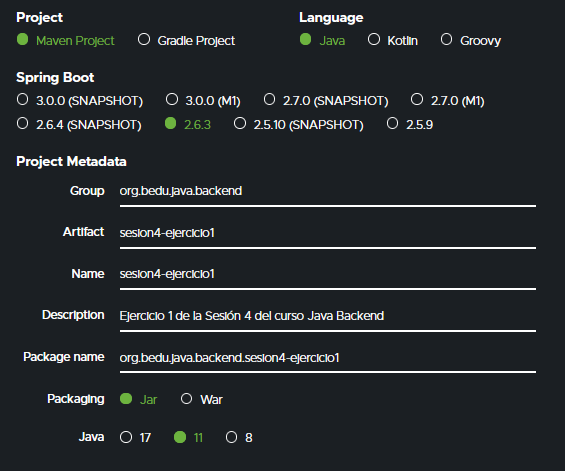

## Ejemplo 02: Objetos como respuesta

### OBJETIVO

- Regresar un objeto JSON como respuesta a una petición HTTP


### DESARROLLO

Crea un proyecto usando Spring Initializr desde el IDE IntelliJ con las siguientes opciones:

  - Gradle Proyect (no te preocupes, no es necesario que tengas Gradle instalado).
  - Lenguaje: **Java**.
  - Versión de Spring Boot, la versión estable más reciente
  - Grupo, artefacto y nombre del proyecto.
  - Forma de empaquetar la aplicación: **jar**.
  - Versión de Java: **11** o superior.



En la siguiente ventana elige Spring Web como la única dependencia del proyecto:


Presiona el botón "Finish".

Ahora, crea dos paquetes dentro de la estructura creada por IntelliJ. El primer paquete se llamará `model` y el segundo `controller`:


Dentro del paquete `model` crea una nueva clase llamada `Usuario`. Esta reprentará a un usuario que crearemos dentro del sistema. Esta clase tendrá las siguientes propiedades:

```java
public class Usuario {
    private String nombre;
    private String apellido;
    private String usuario;
    private String correoElectronico;
    private String password;
    private Direccion direccion;
}
```

Como puedes ver, hemos agregado al final una referencia a una nueva clase, `Direccion`, que crearemos en un momento. Esta clase nos ayudará a demostrar como usando Spring MVC es muy sencillo regresar árboles de objetos, u objetos anidados dentro de otros objetos, dentro de las respuestas creadas por nuestros controladores.

Agrega también sus métodos **getter** y **setter**. 

```java
public class Usuario {
    private String nombre;
    private String apellido;
    private String usuario;
    private String correoElectronico;
    private String password;
    private Direccion direccion;
    
    
    public String getNombre() {
        return nombre;
    }

    public void setNombre(String nombre) {
        this.nombre = nombre;
    }

    public String getApellido() {
        return apellido;
    }

    public void setApellido(String apellido) {
        this.apellido = apellido;
    }

    public String getUsuario() {
        return usuario;
    }

    public void setUsuario(String usuario) {
        this.usuario = usuario;
    }

    public String getCorreoElectronico() {
        return correoElectronico;
    }

    public void setCorreoElectronico(String correoElectronico) {
        this.correoElectronico = correoElectronico;
    }

    public String getPassword() {
        return password;
    }

    public void setPassword(String password) {
        this.password = password;
    }
    
    public Direccion getDireccion() {
        return direccion;
    }

    public void setDireccion(Direccion direccion) {
        this.direccion = direccion;
    }
}
```

Crea en este mismo paquete una segunda clase llamada `Direccion`. Esta representará la calle y número del usuario. Esta clase tendrá tres atributos de tipo `String`:

```java
public class Direccion {
    private String calle;
    private String numero;
    private String codigoPostal;
}
```

No olvides colocar los métodos **getter** y **setter** de esta clase.

Aunque no usemos directamente los **getter** o **setter** de las clases es importante agregarlos ya que tango Spring MCV como [Jackson](https://github.com/FasterXML/jackson) (el motor de parseo y generación de JSON usado por Spring) hacen uso de estos métodos para saber qué propiedades queremos exponer y que sean incluidas en los procesos de conversión de datos entre JSON y objetos Java.

Dentro del paquete `controller` crea una clase llamada `UsuarioController`. Esta clase será igual a la que creamos en el Ejemplo anterior, pero haremos unas modificaciones a su contenido.


```java
@RestController
@RequestMapping("/api/v1/usuario")
public class UsuarioController {
    @PostMapping
    public String creaUsuario(@RequestBody Usuario usuario) {
        System.out.println("Creando usuario");
        System.out.println("Nombre: " + usuario.getNombre());
        System.out.println("Apellido: " + usuario.getApellido());
        System.out.println("Usuario: " + usuario.getUsuario());
        System.out.println("E-Mail: " + usuario.getCorreoElectronico());

        return "Usuario Creado";
    }
}
```

Dentro del método `creaUsuario`, agrega unas líneas antes del final para crear un nuevo objeto de tipo `Direccion` y establece este valor como la dirección del objeto `Usuario` que recibimos como petición:

```java

    @PostMapping
    public String creaUsuario(@RequestBody Usuario usuario) {
        System.out.println("Creando usuario");
        System.out.println("Nombre: " + usuario.getNombre());
        System.out.println("Apellido: " + usuario.getApellido());
        System.out.println("Usuario: " + usuario.getUsuario());
        System.out.println("E-Mail: " + usuario.getCorreoElectronico());

        Direccion direccion = new Direccion();
        direccion.setCalle("Córdoba");
        direccion.setNumero("56");
        direccion.setCodigoPostal("06700");

        usuario.setDireccion(direccion);

        return "Usuario Creado";
    }

```

Si ejecutamos la aplicación con la clase como la tenemos, obtendremos el mismo resultado que obtuvimos en el ejemplo anterior:


Haremos dos pequeños cambios:

1. Cambiar el tipo de retorno del método de `String` a `Usuario`. De esta forma le indicamos a Spring MVC que regresaremos un objeto y Spring MVC lo convertirá de forma automática a un objeto JSON antes de regresarlo al usuario. Es importante mencionar que esta conversión ocurre en automático gracias a nuestra clase está decorada con la anotación `@RestController`, de lo contrario tendríamos que indicar de forma explícita que esta conversión debe hacerse, colocando la anotación `@ResponseBody`.
2. Regresaremos como valor de retorno del método el mismo objeto `usuario` que recibimos como parámetro, solo que esta vez tendrá establecido el valor de la dirección que estamos creando.

El método queda de la siguiente forma:

```java
    @PostMapping
    public Usuario creaUsuario(@RequestBody Usuario usuario) {
        System.out.println("Creando usuario");
        System.out.println("Nombre: " + usuario.getNombre());
        System.out.println("Apellido: " + usuario.getApellido());
        System.out.println("Usuario: " + usuario.getUsuario());
        System.out.println("E-Mail: " + usuario.getCorreoElectronico());

        Direccion direccion = new Direccion();
        direccion.setCalle("Córdoba");
        direccion.setNumero("56");
        direccion.setCodigoPostal("06700");

        usuario.setDireccion(direccion);

        return usuario;
    }
```

Ejecuta nuevamente la aplicación y desde Postman envía una petición a esta URL: [http://localhost:8080/api/v1/usuario](http://localhost:8080/api/v1/usuario). Recueda que esta es una petición de tipo **POST**. Coloca el siguiente contenido en el cuerpo de la petición:


```json
{
    "nombre": "Beto",
    "apellido": "Ornitorrinco",
    "usuario": "expert", 
    "correoElectronico": "beto@bedu.org", 
    "password": "beto1234"
}
```

Y debes obtener esto en Postman.


Hagamos una segunda modificación. Si bien no hay ningún problema en regresar un objeto de esta forma, existe una mejor en la que podemos establecer algunos valores adicionales en caso de ser necesario. 

spring MVC proporciona una clase especial para enviar respuestas llamada `ResponseEntity`. A la cual, además del objeto que estamos regresando, podemos establecerle un código de estatus HTTP en la respuesta. En próximos cursos entrarás más en profundidad en este tema, pero por ahora hagamos el cambio para indicar que el tipo de retorno del método es `ResponseEntity` y creemos una nueva instancia de esta para regresarla como valor.


```java
    @PostMapping
    public ResponseEntity<Usuario> creaUsuario(@RequestBody Usuario usuario) {
        System.out.println("Creando usuario");
        System.out.println("Nombre: " + usuario.getNombre());
        System.out.println("Apellido: " + usuario.getApellido());
        System.out.println("Usuario: " + usuario.getUsuario());
        System.out.println("E-Mail: " + usuario.getCorreoElectronico());

        Direccion direccion = new Direccion();
        direccion.setCalle("Córdoba");
        direccion.setNumero("56");
        direccion.setCodigoPostal("06700");

        usuario.setDireccion(direccion);

        return ResponseEntity.ok(usuario);
    }
```

Como ves, aunque hemos hecho solo un pequeño cambio, este abre muchas posibilidades para tus futuros desarrollos.

Ejecuta nuevamente la aplicación, debes ver la misma salida en Postman.


Para ver la lista completa de los tipos de retorno que puedes usar para los manejadores de peticiones, puedes consultar la [documentación oficial de Spring MVC](https://docs.spring.io/spring-framework/docs/current/reference/html/web.html#mvc-ann-return-types).