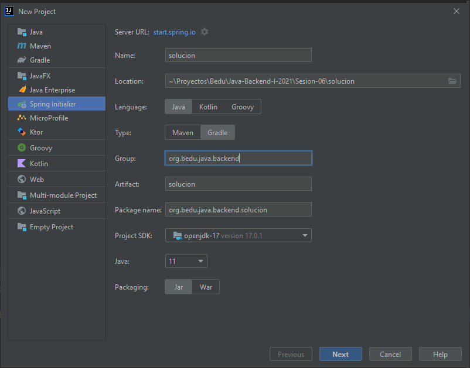
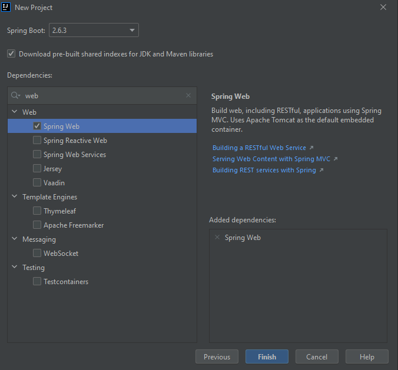
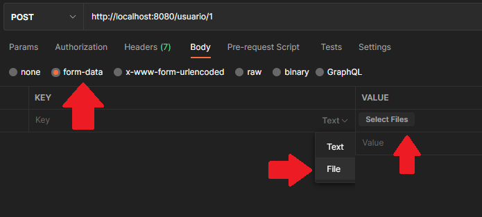
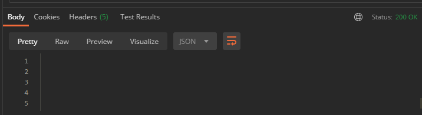

## Ejemplo 03: Carga de archivos

### OBJETIVO

- Cargar un archivo al servidor a través de una petición HTTP


### DESARROLLO

Crea un proyecto usando Spring Initializr desde el IDE IntelliJ con las siguientes opciones:

  - Gradle Proyect (no te preocupes, no es necesario que tengas Gradle instalado).
  - Lenguaje: **Java**.
  - Versión de Spring Boot, la versión estable más reciente
  - Grupo, artefacto y nombre del proyecto.
  - Forma de empaquetar la aplicación: **jar**.
  - Versión de Java: **11** o superior.



En la siguiente ventana elige Spring Web como la única dependencia del proyecto:



Presiona el botón "Finish".

Para este ejemplo solo necesitamos un paquete `controller`. Dentro de este paquete crea una clase llamada `DocumentoController`. 


```java
@RestController
@RequestMapping("/api/v1/documento")
public class DocumentoController {
    
}
```

Para recibir un archivo cargado a través de una petición HTTP, debe hacer lo siguiente: 

```java

   @PostMapping(consumes = MediaType.MULTIPART_FORM_DATA_VALUE)
  public Object cargaArchivo(@RequestPart MultipartFile file) {
    String fileName = file.getOriginalFilename();
    InputStream inputStream = file.getInputStream();
    String contentType = file.getContentType();
    ...
}

```

Hay que tener en cuenta que el nombre del objeto `MultipartFile` decorado con `@RequestPart` debe coincidir con el nombre de la parte en la petición. Veremos cómo hacer esto desde Postman en unos momentos. 


También es posible hacer la carga de múltiples archivos al mismo tiempo declarando el objeto `MultipartFile` como un arreglo, de la siguiente forma:


```java
  @PostMapping(consumes = MediaType.MULTIPART_FORM_DATA_VALUE)
  public Object uploadFile(@RequestPart MultipartFile[] files) {
  
    for (file : files) {
        String fileName = file.getOriginalFilename();
        InputStream inputStream = file.getInputStream();
        String contentType = file.getContentType();
        ...
    }
}
```


Ahora haremos una modificación a la forma en la que hacemos la petición desde Postman. Los cambios correspondientes puedes verlos en esta imagen:




Ahora sí, ejecuta tu aplicación. Debes ver la siguiente respuesta en Postman:



