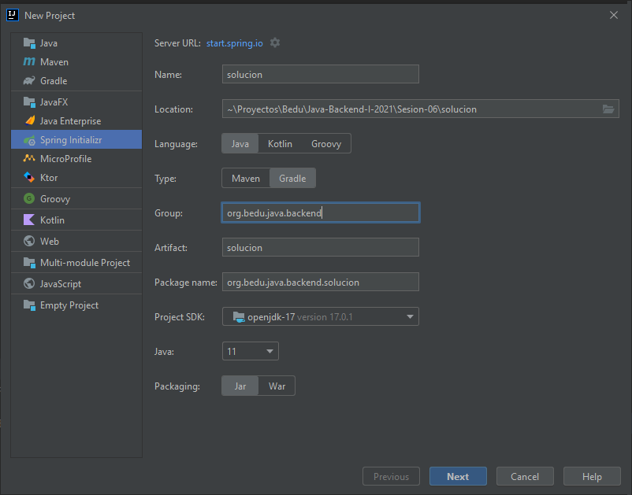

## Sesión 6: Introducción a Spring MVC

### OBJETIVO

- Extender el programa de línea de comandos para utilizar un controlador Web.

### DESARROLLO

En el Postwork de la sesión anterior implementamos una aplicación que recibe el nombre y teléfono de una persona y realiza una validación y limpieza sobre el número de teléfono. En esta ocasión tu misión será extender este programa eliminando la línea de comandos y sustituyéndolo por un controlador web el cual además de recibir la información de la persona a través de un servicio REST, deberá de: 

1. Reciba la información del nombre y número de teléfono en el cuerpo de la petición de un servicio **POST** y aplique el mismo proceso de validación y limpieza del teléfono que desarrollamos en el módulo anterior
1. Almacene la información en memoria usando un `Set` de Java que ordene las entradas de forma alfabética por el nombre de la persona. Para lograr esto `Persona` deberá implementar la interface `java.lang.Comparable`
1. Un servicio REST que al hacer una petición **GET** regrese la información de la agenda en formato JSON.
1. La aplicación debe implementar el patrón MVC. Esto quiere decir que el modelo se encontrará en una capa, el acceso a datos en otra capa y la vista (los servicios Rest) en otra capa. Es posible que para esto debas crear más de un nuevo paquete en la aplicación. 


La lógica de la aplicación debe estar contenida en una clase “servicio” que deberá recibir todas sus dependencias a través de inyección por constructor.

<details>
  <summary>Solución</summary>

  
Crea un proyecto usando Spring Initializr desde el IDE IntelliJ Idea como lo hiciste en la primera sesión. Selecciona las siguientes opciones:

    Grupo, artefacto y nombre del proyecto.
    Tipo de proyecto: **Gradle**.
    Lenguaje: **Java**.
    Forma de empaquetar la aplicación: **jar**.
    Versión de Java: **11** o superior.



En la siguiente ventana selecciona `Spring Web` como la única dependencias del proyecto y presiona el botón `Finish`.


Crea cuatro nuevos paquetes dentro de la aplicación: `model` que contendrá el modelo de datos de la aplicación; `controller` que tendrá el controlador principal de la aplicación; `persistence` que contendrá las clases de acceso a datos; y `service` que tendrá los servicios con la lógica de la aplicación.


Dentro del paquete `model` replica la clase `Persona` del postwork de la sesión anterior. Sobreescribe dos nuevos métodos: `equals` y `hashCode` usando el nombre de la persona. Esto nos ayudará a que el `Set` en el que almacenaremos la información de la agenda no tenga personas repetidas:

```java
public class Persona {
    private String nombre;
    private String telefono;

    public Persona() {
    }

    public Persona(String nombre, String telefono) {
        this.nombre = nombre;
        this.telefono = telefono;
    }

    public String getNombre() {
        return nombre;
    }

    public void setNombre(String nombre) {
        this.nombre = nombre;
    }

    public String getTelefono() {
        return telefono;
    }

    public void setTelefono(String telefono) {
        this.telefono = telefono;
    }

    @Override
    public String toString() {
        return "Persona{" +
                "nombre='" + nombre + '\'' +
                ", telefono='" + telefono + '\'' +
                '}';
    }

    @Override
    public boolean equals(Object o) {
        if (this == o) return true;
        if (o == null || getClass() != o.getClass()) return false;
        Persona persona = (Persona) o;
        return nombre.equals(persona.nombre);
    }

    @Override
    public int hashCode() {
        return Objects.hash(nombre);
    }
}
```

`Persona` debe implementar también la interface `java.lang.Comparable` usando el `nombre` de la persona. Esto permitirá que la lista de personas en la agenda se ordene de forma automática usando este atributo:

```java
@Override
public class Persona implements Comparable<Persona> {
    private String nombre;
    private String telefono;

    public Persona() {
    }

    public Persona(String nombre, String telefono) {
        this.nombre = nombre;
        this.telefono = telefono;
    }

    public String getNombre() {
        return nombre;
    }

    public void setNombre(String nombre) {
        this.nombre = nombre;
    }

    public String getTelefono() {
        return telefono;
    }

    public void setTelefono(String telefono) {
        this.telefono = telefono;
    }

    @Override
    public String toString() {
        return "Persona{" +
                "nombre='" + nombre + '\'' +
                ", telefono='" + telefono + '\'' +
                '}';
    }

    @Override
    public boolean equals(Object o) {
        if (this == o) return true;
        if (o == null || getClass() != o.getClass()) return false;
        Persona persona = (Persona) o;
        return nombre.equals(persona.nombre);
    }

    @Override
    public int hashCode() {
        return Objects.hash(nombre);
    }

    @Override
    public int compareTo(Persona o) {
        return this.nombre.compareTo(o.nombre);
    }
}
```

En el paquete `persistence` crea una nueva clase llamada `AgendaMemoryDao`, esta representará la clase de acceso a datos. En esta sesión la información se almacenará en un `SortedSet` el cual se destruirá al detener la aplicación.

```java
public class AgendaMemoryDao {

    private static final SortedSet<Persona> personas = new TreeSet<>();
}
```

Agrega dos métodos a esta clase, uno que reciba un objeto de tipo `Persona` y lo agregue al `SortedSet` y otro que regrese este `SortedSet`:

```java
public class AgendaMemoryDao {

    private static final SortedSet<Persona> personas = new TreeSet<>();

    public Persona guardaPersona(Persona persona) {
        personas.add(persona);
        return persona;
    }

    public Set<Persona> getPersonas() {
        return personas;
    }
}
```

Para terminar, decora la clase `AgendaMemoryDao` con la anotación `@Repository`, con esto le indicamos a Spring que esta clase debe ser tratada como un **Bean** y su propósito es el acceso a datos.

```java
@Repository
public class AgendaMemoryDao {

    private static final SortedSet<Persona> personas = new TreeSet<>();

    public Persona guardaPersona(Persona persona) {
        personas.add(persona);
        return persona;
    }

    public Set<Persona> getPersonas() {
        return personas;
    }
}
```

Dentro del paquete `service` replica la clase `ValidadorTelefono` de la sesión anterior:

```java
@Service
public class ValidadorTelefono {

    private static final Pattern PATTERN_TELEFONO = Pattern.compile("^(\\d{2,4}[- .]?){2}\\d{4}$");

    public boolean isValido(String telefono) {
        return PATTERN_TELEFONO.matcher(telefono).matches();
    }

    public String limpiaNumero(String telefono){
        return telefono.replaceAll("[^0-9]", "");
    }
}
```

Y dentro de este mismo paquete agrega una nueva clase `AgendaService` la cual reciba una instancia de `ValidadorTelefono` y `AgendaMemoryDao` por medio de inyección de constructor:

```java
public class AgendaService {

    private final ValidadorTelefono validadorTelefono;
    private final AgendaMemoryDao agendaDao;

    @Autowired
    public AgendaService(ValidadorTelefono validadorTelefono, AgendaMemoryDao agendaDao) {
        this.validadorTelefono = validadorTelefono;
        this.agendaDao = agendaDao;
    }
}
```

Agrega un primer método a esta clase que se encargará de recibir como parámetro una persona, validar si el número de teléfono es válido, en cuyo caso eliminará cualquier caracter no numérico y lo guardará en la agenda. Si el teléfono no es válido entonces deberá regresar `null` como valor; de esta forma sabremos que el teléfono no es válido. En módulos posteriores aprenderás una forma mejor de manejar estas validaciones.

```java
    public Persona guardaPersona(Persona persona) {

        if (!validadorTelefono.isValido(persona.getTelefono())) {
            return null;
        }
        String telefono = validadorTelefono.limpiaNumero(persona.getTelefono());

        persona.setTelefono(telefono);

        return agendaDao.guardaPersona(persona);
    }
```

El segundo método será más sencillo, simplemente usará la instancia de `AgendaMemoryDao` para regresar la lista de todas las personas contenidas en la agenda.

```java
    public Set<Persona> getPersonas() {
        return agendaDao.getPersonas();
    }
```

No olvides decorar esta clase con la anotación `@Service`

```java
@Service
public class AgendaService {

    private final ValidadorTelefono validadorTelefono;
    private final AgendaMemoryDao agendaDao;

    @Autowired
    public AgendaService(ValidadorTelefono validadorTelefono, AgendaMemoryDao agendaDao) {
        this.validadorTelefono = validadorTelefono;
        this.agendaDao = agendaDao;
    }

    public Persona guardaPersona(Persona persona) {

        if (!validadorTelefono.isValido(persona.getTelefono())) {
            return null;
        }
        String telefono = validadorTelefono.limpiaNumero(persona.getTelefono());

        persona.setTelefono(telefono);

        return agendaDao.guardaPersona(persona);
    }

    public Set<Persona> getPersonas() {
        return agendaDao.getPersonas();
    }
}
```

Para terminar, debemos crear una nueva clase en el paquete `controller` la cual recibirá las peticiones de nuestros clientes. Esta clase debe estar decorada con las anotaciones `@RestController` y `@RequestMapping`:

@RestController
@RequestMapping("/api/v1/agenda")
public class AgendaController {

}

Además, debe tener una instancia de `AgendaService` que reciba por medio de la inyección de constructor:

```java

private final AgendaService agendaService;

@Autowired
public AgendaController(AgendaService agendaService) {
    this.agendaService = agendaService;
}
```

El primer método que implementaremos regresará la lista completa de `Persona`s que estén registradas en la agenda. Esta corresponderá a un método HTTP **GET**:

```java
@GetMapping
public ResponseEntity<Set<Persona>> getPersonas(){
  return ResponseEntity.ok(agendaService.getPersonas());
}
```

El segundo método de esta clase recibirá un objeto de tipo `Persona`, en el cuerpo de una petición HTTP **POST**, el cual guardará. Si obtiene un valor nulo quiere decir que algo no fue correcto al momento de almacenar la información y regresará un error. Si obtiene un nuevo objeto `Persona` lo regresará en la respuesta. En módulos posteriores aprenderás una mejor forma de manejar estos errores.

```java
    @PostMapping
    public ResponseEntity<Persona> guardaPersona(@RequestBody Persona persona) {
        Persona resultado = agendaService.guardaPersona(persona);

        if (resultado == null) {
            return ResponseEntity.badRequest().build();
        }

        return ResponseEntity.ok(resultado);
    }
```

La clase completa queda de la siguiente forma:
```java
@RestController
@RequestMapping("/api/v1/agenda")
public class AgendaController {

    private final AgendaService agendaService;

    @Autowired
    public AgendaController(AgendaService agendaService) {
        this.agendaService = agendaService;
    }

    @PostMapping
    public ResponseEntity<Persona> guardaPersona(@RequestBody Persona persona) {
        Persona resultado = agendaService.guardaPersona(persona);

        if (resultado == null) {
            return ResponseEntity.badRequest().build();
        }

        return ResponseEntity.ok(resultado);
    }

    @GetMapping
    public ResponseEntity<Set<Persona>> getPersonas(){
        return ResponseEntity.ok(agendaService.getPersonas());
    }
}
```
Ahora ejecuta la aplicación y desde postman envía una petición **POST** a esta URL: [http://localhost:8080/api/v1/agenda](http://localhost:8080/api/v1/agenda):

```json
{
    "nombre": "Beto",
    "telefono": "5512345678"
}
```

Debes obtener la siguiente salida en Postman:


Si ahora consultas la lista de personas registradas debes obtener la siguiente salida [http://localhost:8080/api/v1/agenda](http://localhost:8080/api/v1/agenda):


Continúa agregando más registros para que veas como poco a poco se va llenando la agenda con la información proporcionada.


</details>