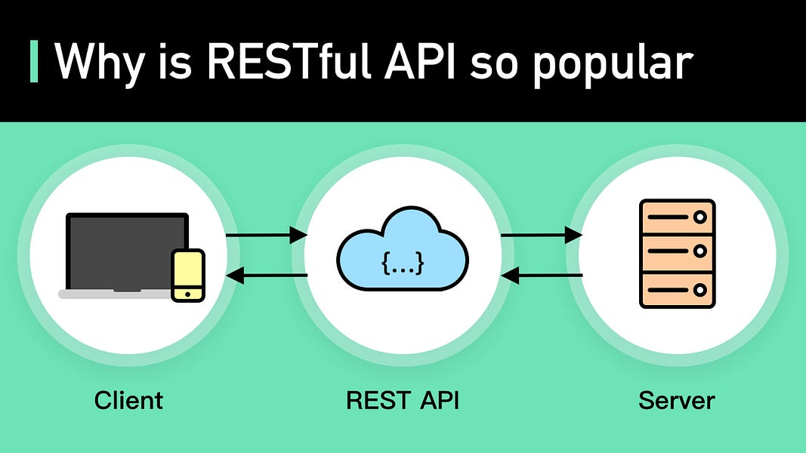

## Sesión 6: Patrón MVC con Spring Boot

### 1. Objetivos :dart:

- Recibir y procesar par�metros de peticiones.
- Regresar objetos como respuesta.
- Cargar y descargar archivos.

### 2. Contenido :blue_book:

Spring MVC es el m�dulo de Spring que se encarga del manejo de peticiones HTTP (el protocolo que se usa en los servicios web REST).

Una API utiliza ciertos protocolos para permitir la comunicaci�n entre aplicaciones programadas en diferentes lenguajes de programaci�n. Ac� es donde entran los servicios web, una tecnolog�a que utiliza un conjunto de est�ndares y protocolos para intercambiar datos entre aplicaciones. En este sentido tenemos dos t�rminos que usualmente son utilizados como sin�nimos: REST y RESTful, estos definen caracter�sticas y/o principios de dise�o que se deben seguir para programar servicios web.

Es importante conocer e implementar bien estos principios de dise�o para crear una API con las caracter�sticas necesarias para ser considerada RESTful.

En la sesi�n 4 ya tuvimos un primer acercamiento a Spring Boot, as� que en esta sesi�n veremos algunos puntos adicionales que te ayudar�n a recibir peticiones de los usuarios de los servicios, y regresar respuestas en distintos formatos.

En este m�dulo aprenderemos:

- Recibir y procesar par�metros de peticiones.
- Regresar objetos como respuesta.
- Cargar y descargar archivos.

---

#### <ins>Tema 1: Par�metros de peticiones HTTP POST y GET</ins>

La forma de comunicarse entre un cliente y el servidor es a trav�s de peticiones HTTP, en el que el cliente env�a una petici�n y datos hacia el servidor, este los interpreta y procesa para generar una respuesta al cliente. Spring MVC es muy flexible y existen muchas formas en las que puede recibir estos par�metros. En el [primer ejemplo](./Ejemplo-01) veremos como recibir informaci�n de una petici�n POST en el cuerpo de la petici�n. Y en tu [primer reto](./Reto-01) deber�s, adem�s de esto, recibir par�metros por la URL en forma de *query string*.

- [**`EJEMPLO 1`**](./Ejemplo-01)
- [**`Reto 1`**](./Reto-01)

---

#### <ins>Tema 2: Regresar objetos como respuesta.</ins>

Ahora que sabemos c�mo recibir una petici�n por parte del usuario, hay que procesarla y darle una respuesta. Existen diferentes formas en las que podemos regresar una respuesta a un cliente. En la siguiente sesi�n veremos c�mo regresar una p�gina web, pero en el [segundo ejemplo](./Ejemplo-02) veremos c�mo regresar un objeto que ser� autom�ticamente convertido en JSON para que el cliente pueda interpretarlo.

- [**`EJEMPLO 2`**](./Ejemplo-02)

---

### 3. Postwork :memo:

Encuentra las indicaciones y consejos para reflejar los avances de tu proyecto de este m�dulo.

- [**`POSTWORK SESI�N 6`**](./Postwork/)

 

