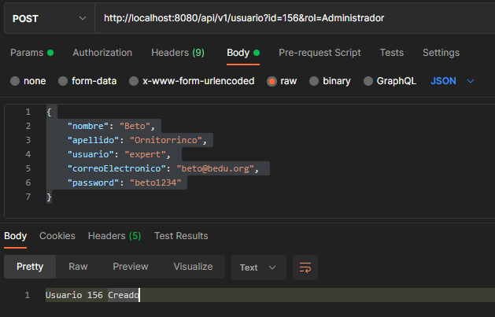
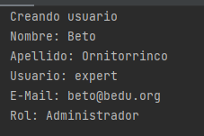

## Reto 01: Parámetros en la *Query String*

### OBJETIVO

- Recibir parámetros en la URL en forma de *query String*

### DESARROLLO

Ahora que pudimos crear un usuario vamos a modificar la forma en la que recibimos algunos de los datos y a agregar uno más. En lugar de esperar el `id` como parte de los elementos de la URL en la petición, los recibiremos en la *query string*, que es ese segmento de la URL que aparece después de un signo `?` y que contiene pares nombre valor, y que separa los diferentes parámetros usando un `&`.

Además de hacer el cambio para recibir el `id`, también deberás recibir el `rol` del usuario como un parámetro más del *query string*. Este será una cadena que contendrá el nombre del `rol`. Este valor debes mostrarlo como parte de los resultados que aparecen en la consola de la petición. El cuerpo del método que maneja las peticiones debe quedar de esta forma:

```java
    {
        System.out.println("Creando usuario");
        System.out.println("Nombre: " + usuario.getNombre());
        System.out.println("Apellido: " + usuario.getApellido());
        System.out.println("Usuario: " + usuario.getUsuario());
        System.out.println("E-Mail: " + usuario.getCorreoElectronico());
        System.out.println("Rol: " + rol);

        return "Usuario " + id + " Creado";
    }
```

La petición que envíes por medio de Postman debe ser a esta URL: [http://localhost:8080/api/v1/usuario?id=156&rol=Administrador](http://localhost:8080/api/v1/usuario?id=156&rol=Administrador). Y el resultado que obtengas de regreso debe verse así:



Y en la consola de IntelliJ Idea debes obtener esta salida:



¡Buena suerte!


---

### Solución

¡Recuerda intentar resolver el reto antes de ver la solución! Una vez que lo hayas intentado puedes dirijirte al [proyecto con la solución](./solucion).