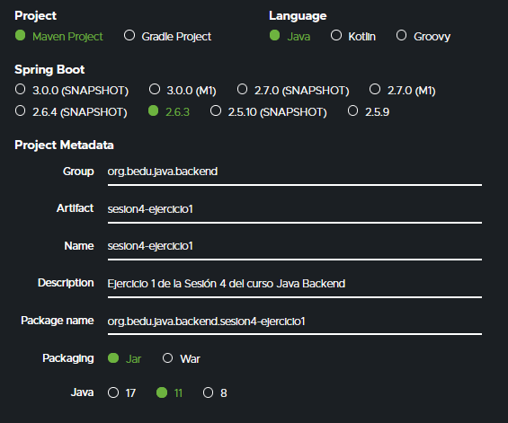
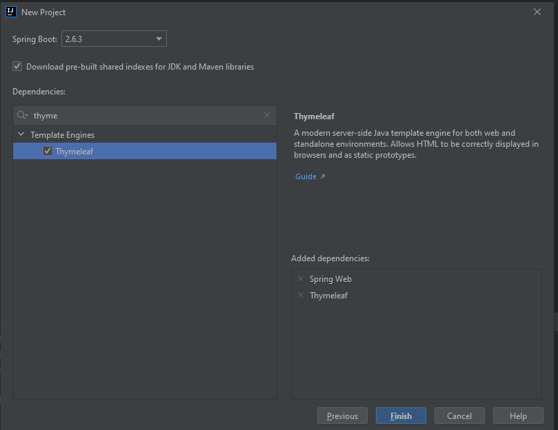
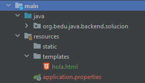
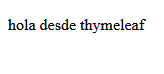

## Ejemplo 01: Integración de Thymeleaf y Spring Boot

### OBJETIVO

- Enviar un mensaje estático desde un controlador de Spring Boot a una página HTML generara con Thymeleaf.


### DESARROLLO

Crea un proyecto usando Spring Initializr desde el IDE IntelliJ con las siguientes opciones:

  - Gradle Proyect (no te preocupes, no es necesario que tengas Gradle instalado).
  - Lenguaje: **Java**.
  - Versión de Spring Boot, la versión estable más reciente
  - Grupo, artefacto y nombre del proyecto.
  - Forma de empaquetar la aplicación: **jar**.
  - Versión de Java: **11** o superior.



En la siguiente ventana elige Spring Web y Thymelead como dependencias del proyecto:



Presiona el botón "Finish".

IntelliJ creará de forma automática un directorio llamdo "templates". Ahí es donde poderemos poner las plantillas que se usarán para la generación de las páginas HTML de nuestros proyectos. Dentro de este directorio crea una nueva página html llamada `hola.html`.



Reemplaza el contenido generado de la página con el siguiente, en donde indicamos que usaremos `th` como el namespace de Thymeleaf (el prefijo que le daremos a sus sentencias):

```html
<!DOCTYPE html>
<html xmlns:th="http://www.thymeleaf.org">
<body>
</body>
</html>
```

Ahora usaremos una *expresión* para indicar que usaremos una variable llamada `mensaje`, la cual será reemplazada con el valor que enviemos desde el controlador:

```html
<!DOCTYPE html>
<html xmlns:th="http://www.thymeleaf.org">
<body>
    <p th:text=${mensaje}></p>
</body>
</html>
```

Ahora crea un nuevo paquete llamado `controller` y dentro de este una clase `SaludoController`. 

```java
public class SaludoController {
    
}
```

Lo primero que haremos es indicar que esta clase es un controlador de Spring MVC decorándola con la anotación `@Controller`.

```java
@Controller
public class SaludoController {

}
```

A continuación, agregamos un manejador de peticiones tipo **GET**. Este manejador no recibirá ningún parámetro y regresará un objeto de tipo `ModelAndView`:

```java
@GetMapping("/hola")
public ModelAndView hola() {

}
```

En el cuerpo de este método creamos una nueva instancia de `ModelAndView`. En el constructor le indicamos que el resultado de la petición será enviado a una vista llamada `hola` (el mismo nombre de la página que creamos hace un momento). Spring en automático buscará en el directorio `templates` un archivo que coincida con el nombre de la vista que estamos regresando.

```java
  @GetMapping("/hola")
  public ModelAndView hola() {
      ModelAndView mav = new ModelAndView("hola");
  }
```

Finalmente, agregamos en el objeto `ModelAndView` valor de la variable `mensaje` en forma de atributo y regresamos este objeto como valor de retorno del método:


```java
    @GetMapping("/hola")
    public ModelAndView hola() {
        ModelAndView mav = new ModelAndView("hola");
        mav.addObject("mensaje", "hola desde thymeleaf");
        return mav;
    }
```

Para terminar, ejecuta la aplicación y entra a la siguiente dirección desde tu navegador [http://localhost:8080/hola](http://localhost:8080/hola). Debes ver la siguiente salida:



