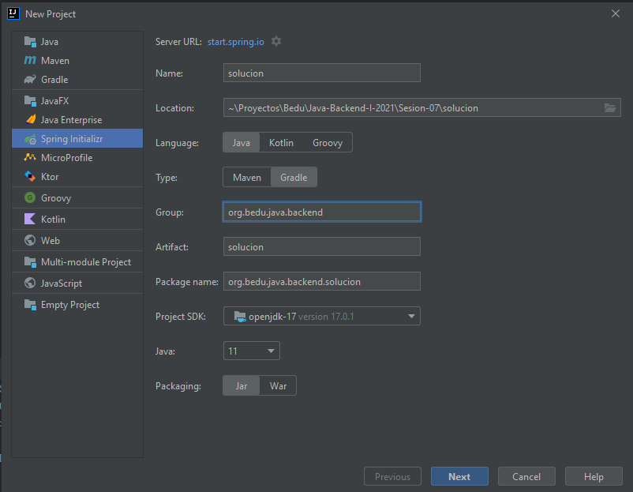
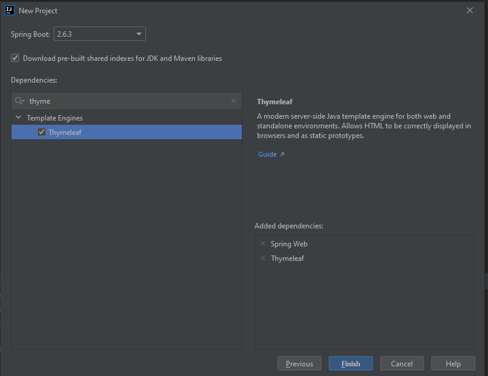
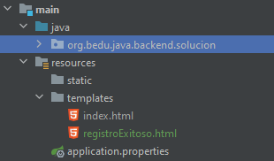
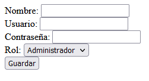
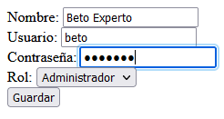

## Ejemplo 02: Manejo de formularios

### OBJETIVO

- Capturar información del usuario a través de un formulario que será enviado al servidor para procesar su información.


### DESARROLLO

Crea un proyecto usando Spring Initializr desde el IDE IntelliJ con las siguientes opciones:

  - Gradle Proyect (no te preocupes, no es necesario que tengas Gradle instalado).
  - Lenguaje: **Java**.
  - Versión de Spring Boot, la versión estable más reciente
  - Grupo, artefacto y nombre del proyecto.
  - Forma de empaquetar la aplicación: **jar**.
  - Versión de Java: **11** o superior.



En la siguiente ventana elige Spring Web y Thymelead como dependencias del proyecto:


 
Presiona el botón "Finish".

IntelliJ creará de forma automática un directorio llamdo "templates". Ahí es donde poderemos poner las plantillas que se usarán para la generación de las páginas HTML de nuestros proyectos. Dentro de este directorio crea una nueva página html llamada `index.html` y otra página llamada "registroExitoso.html".



En `index.html` colocaremos un pequeño formulario que nos permitirá registrar a un usuario al cual le pediremos su nombre real, nombre de usuario, contraseña y rol. No te preocupes de la parte gráfica, en este curso nos ocuparemos de que el formulario sea funcional y en otros módulos haremos que tenga una mejor presentación. En el formulario usaremos los siguientes elementos de Thymeleaf:

- **th:action**: indica qué manejador de peticiones procesará la información del formulario.
- **th:object**: el objeto que usaremos para llenar los datos del formulario (los cuales estarán inicialmente vacíos) y para enviar los datos al controlador que los procesará (una vez que hayamos llenado la información).
- **th:field**: indica qué atributo de nuestro objeto está ligado con ese campo del formulario.

El formulario contiene 4 campos y un botón para enviar la información al controlador correspondiente de Spring MVC.

```html
<!DOCTYPE html>
<html xmlns:th="http://www.thymeleaf.org">
<head>
    <title>Registro</title>
</head>
<body>
<form th:action="@{/registro}" th:object="${usuario}" method="post">
    <div>
        <label for="nombre">Nombre: </label>
        <input id="nombre" type="text" th:field="*{nombre}">
    </div>
    <div>
        <label for="username">Usuario: </label>
        <input id="username" type="text" th:field="*{username}">
    </div>
    <div>
        <label for="password">Contraseña: </label>
        <input id="password" type="password" th:field="*{password}">
    </div>

    <div>
        <label for="rol">Rol: </label>
        <select name="rol" id="rol" th:field="*{rol}">
            <option value="administrador">Administrador</option>
            <option value="cliente">Cliente</option>
        </select>
    </div>

    <input type="submit" th:value="Guardar"/>
</form>
</body>
</html>
```

Ahora crea un paquete llamado `model`. Ahi colocaremos la clase `Usuario` la cual nos ayudará a recibir la información del formulario. `Usuario` tiene los siguientes atributos:

```java
public class Usuario {
    private String nombre;
    private String username;
    private String rol;
    private String password;
}
```

Agrega los correspondientes **getters** y **setters**; no es necesario agregar ningún constructor a la clase anterior.

Ahora crea un nuevo paquete llamado `controller` y dentro de este una clase `UsuarioController`. 

```java
public class UsuarioController {
    
}
```

Lo primero que haremos es indicar que esta clase es un controlador de Spring MVC decorándola con la anotación `@Controller`.

```java
@Controller
public class UsuarioController {

}
```

A continuación, agregamos un manejador de peticiones tipo **GET**. Este manejador será invocado cuando solicitemos que se muestre el formulario vacío y colocará un `Usuario` "nuevo" (sin datos) para inicializar el formulario. Este es un paso incómodo pero necesario cuando trabajamos con Thymeleaf, ya que asocia un objeto al formulario y si no regresamos este objeto inicial obtendremos un error.

Indicamos en el manejador que debe regresar el template con el nombre `index`.

```java
    @GetMapping({"/", "/index"})
    public String formularioRegistro(Model model){
        model.addAttribute("usuario", new Usuario());
        return "index";
    }
```

Agregamos un segundo manejador, para peticiones **POST**. Este segundo manejador será el que procese la petición una vez que el usaurio haya llenado el formulario. Lo único que haremos en este momento es recibir como parámetro el objeto `Usuario`, el cual contendrá la información que colocamos en el formulario, y lo regresaremos a una nueva vista en la plantilla `registroExitoso`:

```java
    @PostMapping("/registro")
    public ModelAndView registra(Usuario usuario) {
        ModelAndView mav = new ModelAndView("registroExitoso");
        mav.addObject("usuario", usuario);
        return mav;
    }
```

Finalmente, en la plantilla `registroExitoso.html` colocamos un mensaje felicitando al usuario por el registro:


```html
<!DOCTYPE html>
<html xmlns:th="http://www.thymeleaf.org">
<head>
    <meta charset="UTF-8">
    <title>Registro Exitoso</title>
</head>
<body>
Bienvenido <strong><span th:text=${usuario.nombre}/></strong> tu registro ha sido exitoso
</body>
</html>
```

Ejecuta la aplicación y entra a la siguiente dirección desde tu navegador [http://localhost:8080/](http://localhost:8080). Debes ver el siguiente formulario:



Coloca la información solicitada y presiona el botón `Guardar`:



Debes ver la siguiente salida:


