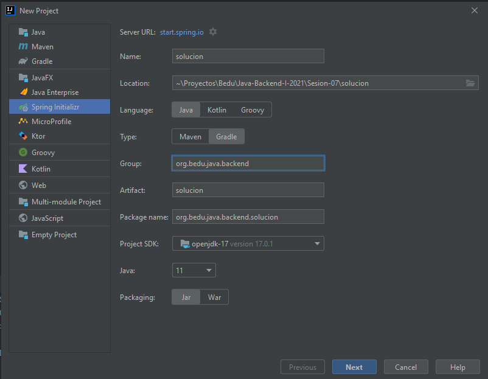
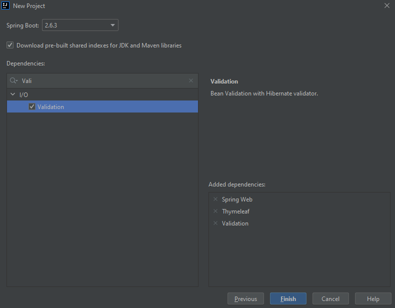
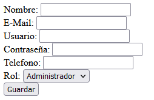
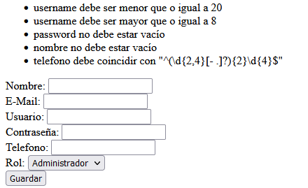
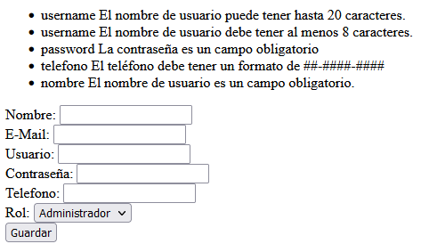

## Ejemplo 03: Validación de datos

### OBJETIVO

- Validar que la información introducida por el usuario en un formulario es correcta.
- Agregar validaciones del lado del servidor que evite procesar información incorrecta proporcionada por el usuario.


### DESARROLLO

Crea un proyecto usando Spring Initializr desde el IDE IntelliJ con las siguientes opciones:

  - Gradle Proyect (no te preocupes, no es necesario que tengas Gradle instalado).
  - Lenguaje: **Java**.
  - Versión de Spring Boot, la versión estable más reciente
  - Grupo, artefacto y nombre del proyecto.
  - Forma de empaquetar la aplicación: **jar**.
  - Versión de Java: **11** o superior.



Ahora seleccionaremos una dependencia adicional a Spring Web y Thymeleaf, `Validation`. Esta dependencia contiene las anotaciones que nos servirán para validar la información de nuestros objetos de dominio:


 
Presiona el botón "Finish".

En esta ocasión comenzaremos generando el formulario. Traeremos de regreso el formulario que realizamos en el [segundo ejemplo](../Ejemplo-02) de la sesión y agregaremos un nuevo campo: el correo electrónico del nuevo usuario:

```html
<!DOCTYPE html>
<html xmlns:th="http://www.thymeleaf.org">
<head>
    <title>Registro</title>
</head>
<body>
<form th:action="@{/registro}" th:object="${usuario}" method="post">
    <div>
        <label for="nombre">Nombre: </label>
        <input id="nombre" type="text" th:field="*{nombre}">
    </div>
    <div>
        <label for="email">E-Mail: </label>
        <input id="email" type="email" th:field="*{email}">
    </div>
    <div>
        <label for="username">Usuario: </label>
        <input id="username" type="text" th:field="*{username}">
    </div>

    <div>
        <label for="password">Contraseña: </label>
        <input id="password" type="password" th:field="*{password}">
    </div>

    <div>
        <label for="telefono">Telefono: </label>
        <input id="telefono" type="text" th:field="*{telefono}">
    </div>

    <div>
        <label for="rol">Rol: </label>
        <select name="rol" id="rol" th:field="*{rol}">
            <option value="administrador">Administrador</option>
            <option value="cliente">Cliente</option>
        </select>
    </div>

    <input type="submit" th:value="Guardar"/>
</form>
</body>
</html>
```

Ahora, crea la clase `Usuario` en el paquete `model`, la cual tiene los siguientes atributos:

```java
public class Usuario {
    private String nombre;
    private String email;
    private String username;
    private String rol;
    private String password;
    private String telefono
}    
```

Agrega también los *getter*s y *setter*s de cada atributo. No es necesario agregar constructores.

Ahora, agregaremos las validaciones. Para validar la información debemos decorar los campos con las correspondientes anotaciones del API *Bean Validator**. En cada campo indicaremos las restricciones para cada uno de los valores. En el campo `telefono` colocaremos la expresión regular que hemos estado usando para validar el formato del mismo. Gracias a esto delegaremos el trabajo de realizar la validación a Spring antes de que siquiera recibamos la información en el controlador.

```java
    @NotBlank
    private String nombre;

    @Email
    private String email;

    @Min(8)
    @Max(20)
    private String username;

    @NotBlank
    private String rol;

    @NotBlank
    private String password;

    @Pattern(regexp = "^(\\d{2,4}[- .]?){2}\\d{4}$")
    private String telefono;
```

Como puedes ver, cada atributo puede tener más de una validación.

En el paquete `controllers` agrega una clase llamada `UsuarioController` y decórala con la anotación `@Controller`, de la siguiente forma:

```java
@Controller
public class UsuarioController {
}
```


Agrega un nuevo manejador de peticiones tipo `GET` el cual reciba como parámetro un objeto de tipo `Model` y regrese un objeto de tipo `String`. Este será el manejador que usaremos para mostrar la página con el formulario de registro.

```
    @GetMapping({"/", "/index"})
    public String formularioRegistro(Model model){
        model.addAttribute("usuario", new Usuario());
        return "index";
    }
```

Agrega un nuevo manejador de peticiones **POST** que reciba un objeto de tipo `Usuario` y regrese un `ModelAndView`. Este manejador indicará que una vez concluida la petición, el cliente debe ser enviado a la vista generada usando la plantilla `registroExitoso`.

```java
    @PostMapping("/registro")
    public ModelAndView registra(Usuario usuario) {
        ModelAndView mav = new ModelAndView("registroExitoso");
        mav.addObject("usuario", usuario);
        return mav;
    }
```

Lo siguiente es indicarle a Spring que deseamos que valide la información del objeto `Usuario` que este manejador recibe como parámetro. Para eso debemos decorar este parámetro con la anotación `@Valid`:

```java
public ModelAndView registra(@Valid Usuario usuario) {
  ...
}
```

Ahora, crea la plantilla `registroExitoso` con el siguiente contenido:

```java
<!DOCTYPE html>
<html xmlns:th="http://www.thymeleaf.org">
<head>
    <meta charset="UTF-8">
    <title>Registro Exitoso</title>
</head>
<body>
Bienvenido <strong><span th:text=${usuario.nombre}/></strong> tu registro ha sido exitoso
</body>
</html>
```

Antes de ejecutar la aplicación debemos hacer un par de modificaciones más. La primera es a la plantilla donde se encuentra el formulario `index.html`. Necesitamos indicar en qué lugar se mostrarán los mensajes de error de los campos que no cumplan con las validaciones. Para mostrar todos los mensajes de error, debemos colocar el siguiente bloque dentro de nuestro formulario:

```html
<form th:action="@{/registro}" th:object="${usuario}" method="post">
    <div th:if="${#fields.hasAnyErrors()}">
        <ul>
            <li th:each="err : ${#fields.detailedErrors()}" th:text="${err.getFieldName() + err.getMessage() }"/>
        </ul>
    </div>
    
    ...
</form>    
```

Aquí, se usa el objeto `fields` que Thymeleaf coloca de forma implícita en la página, y ciclamos a través de todos los mensajes de error que se tengan. 

Ahora, en `UsuarioController` en el método manejador de peticiones en donde procesamos la información del registro, debemos indicarle a Spring que si hay un error queremos regresar a la misma página en donde está el formulario. Esto típicamente lo hacemos recibiendo un parámetro de tipo `org.springframework.validation.Errors`, el cual nos ayuda a identificar si ha ocurrido algún error de validación, en cuyo caso indicamos que debemos regresar a la plantilla `index`:

```java
    @PostMapping("/registro")
    public ModelAndView registra(@Valid Usuario usuario, Errors errors) {

        String vistaResultado = "registroExitoso";

        if(errors.hasErrors()){
            vistaResultado = "index";
        }

        ModelAndView mav = new ModelAndView(vistaResultado);
        mav.addObject("usuario", usuario);
        return mav;
    }
```

Ahora ejecuta la aplicación y entra en la siguiente dirección [http://localhost:8080/](http://localhost:8080/). Debes ver el siguiente formulario:




Llena los campos con información incorrecta y presiona el botón `Guardar`. Debes ver una pantalla como la siguiente:



Si bien ya estamos viendo los errores, los mensajes que se despliegan no son los más claros. Podemos personalizar el contenido del mensaje usando el atributo `message` de las anotaciones que usamos para validar la información en la clase `Usuario`:

```java
    @NotBlank(message = "El nombre de usuario es un campo obligatorio.")
    private String nombre;

    @Email(message = "El correo electrónico tiene un formato incorrecto.")
    private String email;

    @Min(value = 8, message = "El nombre de usuario debe tener al menos 8 caracteres.")
    @Max(value = 20, message = "El nombre de usuario puede tener hasta 20 caracteres.")
    private String username;

    @NotBlank(message = "El rol del usuario es un campo obligatorio.")
    private String rol;

    @NotBlank(message = "La contraseña es un campo obligatorio")
    private String password;

    @Pattern(regexp = "^(\\d{2,4}[- .]?){2}\\d{4}$", message = "El teléfono debe tener un formato de ##-####-####")
    private String telefono;
```

Llena nuevamente los campos con información incorrecta y presiona el botón `Guardar`. Debes ver una pantalla como la siguiente:


