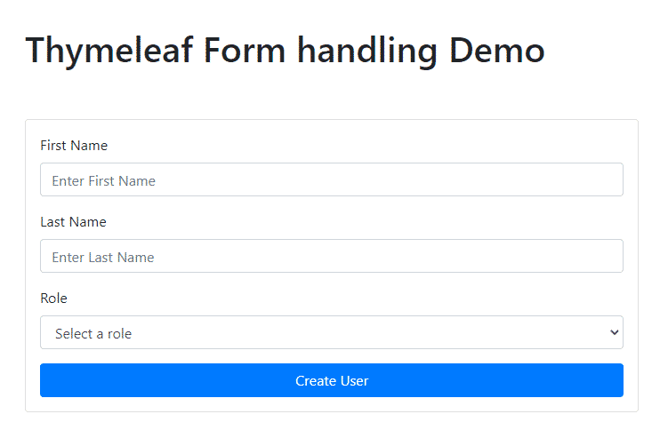
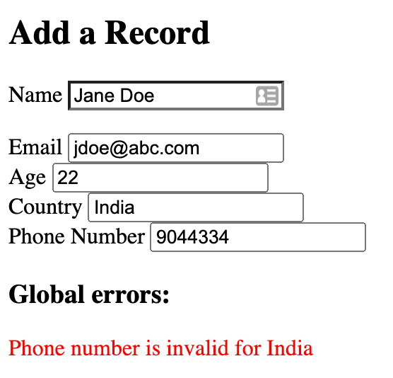

## Sesión 7: Integración de Thymeleaf y Spring Boot

### 1. Objetivos :dart:

- Integrar Thymeleaf como motor de generaci�n de vistas en una aplicaci�n desarrollada usando Spring Boot.
- Mostrar mensajes est�ticos en una p�gina web.
- Mostrar mensajes din�micos en una p�gina web.
- Procesar formularios.

### 2. Contenido :blue_book:

Thymeleaf es un motor de plantillas Java para aplicaciones, tanto web como standalone, construido sobre est�ndares HTML5, por lo que es compatible con la inmensa mayor�a de navegadores. Entre sus principales caracter�sticas cabe destacar su flexibilidad y su alto rendimiento que, junto con su facilidad de aprendizaje y su poco intrusismo en el marcado lo convierten en una alternativa real a otras opciones m�s populares como JSP.

En este m�dulo aprenderemos:

- Integrar Thymeleaf como motor de generaci�n de vistas en una aplicaci�n desarrollada usando Spring Boot.
- Generar contenido est�tico.
- Generar contenido din�mico.
- Manejo de formularios.

---

#### <ins>Tema 1: Integraci�n de Thymeleaf y Spring Boot</ins>

Thymeleaf como motor de plantillas se integra de una forma perfecta con los controladores de Spring MVC. En el primer tema aprenderemos c�mo realizar esta integraci�n y a desplegar un mensaje est�tico en un HTML generado en el [primer ejemplo](./Ejemplo-01), mientras que en el [primer reto](./Reto-01) tendr�s que modificar este mensaje para que sea din�mico.

- [**`EJEMPLO 1`**](./Ejemplo-01)
- [**`Reto 1`**](./Reto-01)

---

#### <ins>Tema 2: Manejo de formularios.</ins>

La forma m�s habitual de obtener informaci�n de un usuario es a trav�s de un formulario, el cual es un conjunto de campos agrupados a trav�s de los cuales solicitamos esta informaci�n. En el [segundo ejemplo](./Ejemplo-02) aprenderemos c�mo generar un formulario y enviar su informaci�n a un controlador para que sea procesada.

- [**`EJEMPLO 2`**](./Ejemplo-02)

---

#### <ins>Tema 3: Validaci�n de formularios y manejo de errores.</ins>

Aunque un formulario est� bien dise�ado, podemos esperar que habr� usuarios que introducir�n informaci�n incorrecta, ya sea de forma accidental o buscando causar alg�n da�o. Es por eso que la validaci�n de los datos y sus formatos dentro de un formulario es muy importante. En el [ejemplo 3](./Ejemplo-03) aprenderemos c�mo realizar una validaci�n b�sica de un formulario y en el [segundo reto](./Reto-02) deber�s adem�s mostrar un mensaje de error cuando ocurra alg�n problema de validaci�n. 

- [**`EJEMPLO 3`**](./Ejemplo-03)
- [**`Reto 2`**](./Reto-02)

---

### 3. Postwork :memo:

Encuentra las indicaciones y consejos para reflejar los avances de tu proyecto de este m�dulo.

- [**`POSTWORK SESI�N 7`**](./Postwork/)

 

