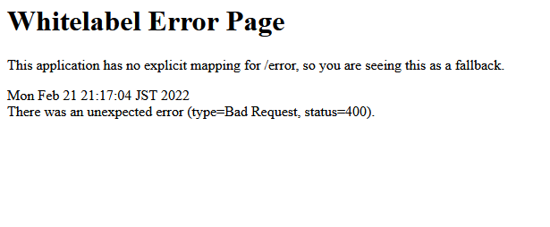

## Reto 01: Valores dinámicos con Thymeleaf

### OBJETIVO

- Generar un mensaje de forma dinámico que se muestre en una página HTML generada con Thymeleaf

### DESARROLLO

Ahora que pudimos mostrar un mensaje estático en una página creada con Thymeleaf es momento de cambiarlo por uno dinámico. En esta ocasión deberás recibir una cadena de texto proporcionada por el usuario y mostrar la en una página. La cadena de texto puede contener cualquier número de caracteres y espacios en blanco.

No te preocupes si al momento de ejecutar la aplicación esta muestra el siguiente contenido, eso quiere decir que el controlador no está recibiendo el parámetro proporcionado:

¡Buena suerte!

---

### Solución

¡Recuerda intentar resolver el reto antes de ver la solución! Una vez que lo hayas intentado puedes dirijirte al [proyecto con la solución](./solucion).