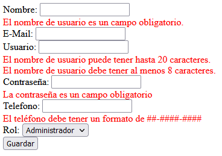

## Reto 02: Mensajes de error

### OBJETIVO

- Indicar en la página web cuando ocurra un error de validación, y darle suficiente información al usuario para que corrija por si mismo el error.
- Colocar los errores de validación debajo del campo correspondiente en lugar de colocarlo de forma global para todo el formulario.

### DESARROLLO

Ya hemos validado que la información introducida por el usuario dentro del formulario cumpla con el formato que estamos esperando. También, mostramos una lista de todos los errores que ocurren en el formulario y personalizamos los mensajes de cada uno de los campos. 

Sin embargo, mostramos todos los errores en una misma sección, en la parte superior del formulario. Así que puede ser algo complicado saber a qué campo corrresponde cada uno de los errores.

Es mejor mostrar el mensaje de error correspondiente debajo de cada uno de los campos. De esta forma el usuario sabrá exactamente a qué campo corresponde cada uno de los errores. Tu reto en esta ocasión es mover los mensajes de error del formulario de la parte superior, y mostrarlo debajo de los campos correspondientes.

Recuerda que para eso debes usar los elementos correspondientes de Thymeleaf, y validar si existe o no un error para el campo antes de mostrar el mensaje de error.

No te preocupes por darle estilos a tu formulario:

El resultado final debe verse así:

¡Buena suerte!

---

### Solución

¡Recuerda intentar resolver el reto antes de ver la solución! Una vez que lo hayas intentado puedes dirijirte al [proyecto con la solución](./solucion).