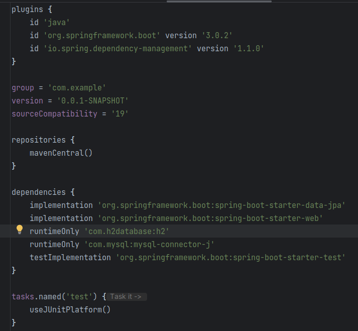
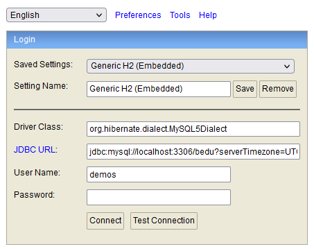
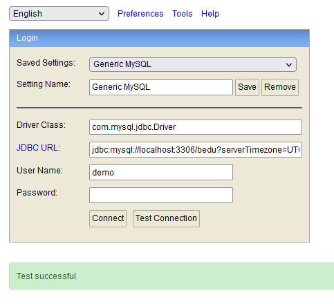
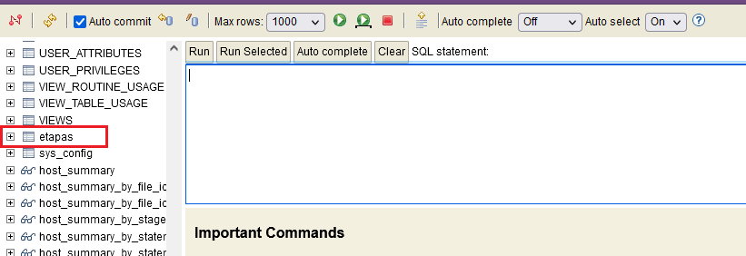
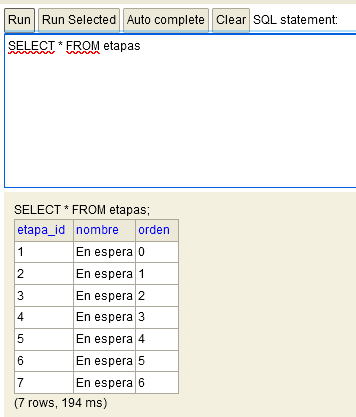

## Ejemplo 03: Consola de H2

### OBJETIVO

- Usar la consola integrada con la base de datos embebida H2 para conectarnos a la instancia de MySQL.
- Proporcionar un mecanismo sencillo para poder adminsitrar la información de la base de datos sin herramientas externas.


### DESARROLLO

Utilizaremos el mismo proyecto del ejemplo 01.

Agregaremos una dependencia adicional a `Spring Web`, `MySQL Driver` y `Spring Data JPA`, `H2 Database`.

Para agregarla modificaremos `build.gradle`, agregando la siguiente linea dentro de dependencias.

```groovy
	runtimeOnly 'com.h2database:h2'
```



Coloca el siguiente contenido en el archivo `application.properties` (los valores entre los signos < y > reemplazalos con tus propios valores):

```groovy
spring.h2.console.enabled=true
spring.jpa.hibernate.ddl-auto=none
spring.sql.init.mode=always
spring.jpa.open-in-view=false
spring.jpa.properties.hibernate.dialect=org.hibernate.dialect.MySQL5Dialect
spring.datasource.driver-class-name=com.mysql.cj.jdbc.Driver
spring.datasource.url=jdbc:mysql://localhost:3306/bedu?serverTimezone=UTC
spring.datasource.username=<usuario>
spring.datasource.password=<password>
```

Ejecuta la aplicación. No debería haber ningún error en la consola y la aplicación debe iniciar de forma correcta. 

Ingresa a la siguiente dirección en tu navegador [http://localhost:8080/h2-console/](http://localhost:8080/h2-console/). Debes ver una venta como la siguiente:



Cambia la información del `Driver Class`, `JDBC URL`, `User Name` y `Password` a los valores correspondientes a MySQL (los que tienes en el archivo `application.properties`).

- Driver Class: org.hibernate.dialect.MySQL5Dialect
- JDBC URL: jdbc:mysql://localhost:3306/bedu?serverTimezone=UTC

Presiona el botón `Test Connection`, debe aparecer un mensaje indicando que la prueba es exitosa (y el password debe haber desaparecido).



Vuelve a colocar el password y presiona el botón Connect debes entrar a la consola de H2. Esta consla muestra muchas tablas. Las de tu aplicación serán las últimas:



Escribe una consulta en la consola; la información aparcera en el panel de respuestas.




<br>

[**`Siguiente`** -> postwork](../Postwork/)

[**`Regresar`**](../)