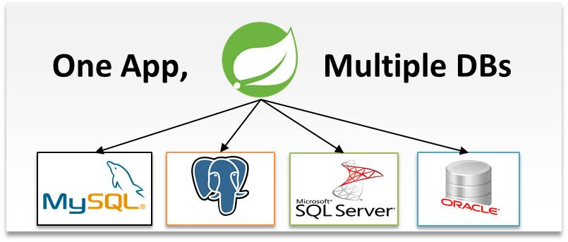

## Sesión 8: Conexión a base de datos con Spring Data

### 1. Objetivos :dart:

- Identificar qu� es una entidad, c�mo se usa en una aplicaci�n y c�mo declararla.
- Reconocer qu� es un repositorio de Spring Data y la forma de declararlos.
- Hacer uso de una consola embebida en la aplicaci�n para realizar consultas.

### 2. Contenido :blue_book:

Cuando trabajamos para conectar nuestra aplicaci�n a una base de datos y realizar operaciones sobre estas, puede que el c�digo sea un tanto repetitivo afectando la calidad de nuestro trabajo haci�ndolo dif�cil de leer. Java tambi�n tiene una soluci�n para este problema: la Java Persistence API (JPA). Una API para simplificar el trabajo con las bases de datos.

Spring tambi�n proporciona un contenedor para trabajar con JPA, estamos hablando del Spring Data JPA container. Para comprender JPA y Spring Data JPA debemos hablar sobre entidades y repositorios, dos elementos fundamentales en el tema. M�s adelante hablaremos sobre estos as� como el funcionamiento de Spring Data JPA.

En este m�dulo aprenderemos:

- La forma correcta de declarar entidades y almacenarlas en una base de datos relacional.
- Crear un repositorio de Spring Data para guardar y recuperar entidades.
- Integrar la consola de H2 para visualizar la informaci�n de la base de datos-

---

#### <ins>Tema 1: Introducci�n a Spring Data JPA</ins>

Spring Data JPA es el m�dulo de Spring que permite trabajar con JPA en nuestras aplicaciones, encapsulando toda la complejidad del acceso a datos : nos ahorra escribir c�digo repetitivo para ejecutar consultas simples o para realizar la paginaci�n y auditor�a. El objetivo de Spring Data JPA es mejorar significativamente la implementaci�n de la capa de acceso de datos y reducir el esfuerzo a lo realmente necesario.

En el [primer ejemplo](./Ejemplo-01) aprenderemos a usar la anotaciones b�sicas de Spring Data JPA para indicar los objetos de una clase deben ser tratados como entidades de la base de datos. Adem�s crearemos nuestro primer repositorio. En el [primer reto](./Reto-01) deber�s hacer uso de este m�dulo de Spring para crear y recuperar una lista de productos almacenados en una base de datos MySQL a trav�s de un API REST.

- [**`EJEMPLO 1`**](./Ejemplo-01)
- [**`Reto 1`**](./Reto-01)

---

#### <ins>Tema 2: Inicializaci�n de datos</ins>

En algunas ocasiones necesitamos que cierta informaci�n exista en la base de datos para que nuestra aplicaci�n funcione de forma correcta. Algunos cat�logos o datos de configuraci�n que la misma usar�. En el [segundo ejemplo](./Ejemplo-02) veremos una forma de hacer esta inicializaci�n implementando la interface `CommandLineRunner` de Spring Boot y en el [segundo reto](./Reto-2) deber�s lograr esto mismo pero ejecutando un script `SQL`

- [**`EJEMPLO 2`**](./Ejemplo-02)
- [**`Reto 2`**](./Reto-02)

---

#### <ins>Tema 3:Uso de la consola embebdida H2 para manejar la base de datos</ins>

No siempre tendremos la opci�n de conectarnos a la base de datos de nuestra aplicaci�n desde una herramienta externa, es por eso que H2 proporciona una consola de SQL que puede incrustarse en nuestras aplicaciones y permite conectarse a diferentes gestores de bases de datos. En el [tercer ejemplo](./Ejemplo-03) veremos c�mo hacer esto para poder realizar consultas directamente a nuestra aplicaci�n.

- [**`EJEMPLO 3`**](./Ejemplo-03)

---

### 3. Postwork :memo:

Encuentra las indicaciones y consejos para reflejar los avances de tu proyecto de este m�dulo.

- [**`POSTWORK SESI�N 8 `**](./Postwork/)

 

