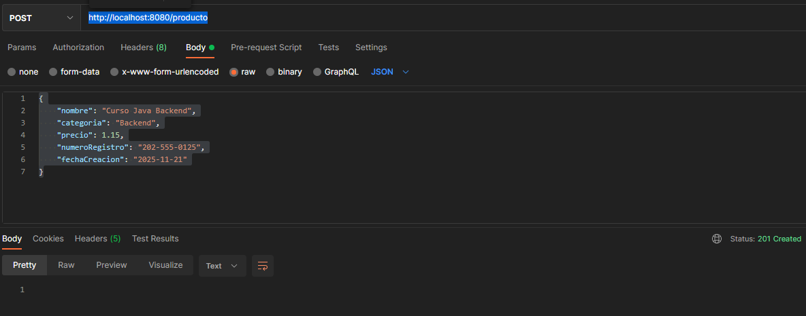
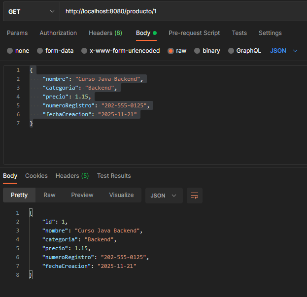

## Reto 01: Persistencia de datos con Spring Data JPA

### OBJETIVO

- Obtener información almacenada en la base de datos.
- Hacer uso de las anotaciones básicas de JPA para indicar qué objeto debe ser tratado como una entidad de base de datos.
- Aprender qué es un repositorio y los métodos por default que ofrece.


### DESARROLLO

- Crea un nuevo proyecto usando Spring Initilizr y agrega las dependencias de `Spring Web`, `Spring Data JPA` y `MySQL Driver`.
- Crea los subpaquetes: `controller`, `model` y `persistence`.
- Crea una clase `Producto` y coloca las anotaciones correspondientes JPA.
- Crea una clase `ProductoRepository` que extienda de `JpaRepository`.
- Crea una clase `ProductoController` que haga uso de la interface anterior.
- Implementa las funcionalidades de guardar un nuevo objeto Producto usando un método POST.
- Implementa un método GET que reciba el ID de un objeto Producto y lea el objeto correspondiente de la base de datos. Si no se encuentra el objeto con el ID correspondiente se deberá regresar un error 404.
- Realiza la prueba del reto usando Postman.


La clase `Producto` debe tener los siguientes atributos:

```java
    private Long id;
    private String nombre;
    private String categoria;
    private float precio;
    private String numeroRegistro;
    private LocalDate fechaCreacion;
```

Al realizar una petición para crear un nuevo recurso con el siguiente contenido en [http://localhost:8080/producto](http://localhost:8080/producto):

```json
{
    "nombre": "Curso Java Backend",
    "categoria": "Backend",
    "precio": 1.15,
    "numeroRegistro": "202-555-0125",
    "fechaCreacion": "2025-11-21"
}
```

Debes obtener la siguiente respuesta



Y al recuperar el nuevo custo creado, debes obtener la siguiente respuesta [http://localhost:8080/producto/1](http://localhost:8080/producto/1)



---

### Solución

¡Recuerda intentar resolver el reto antes de ver la solución! Una vez que lo hayas intentado puedes dirijirte al [proyecto con la solución](./solucion).